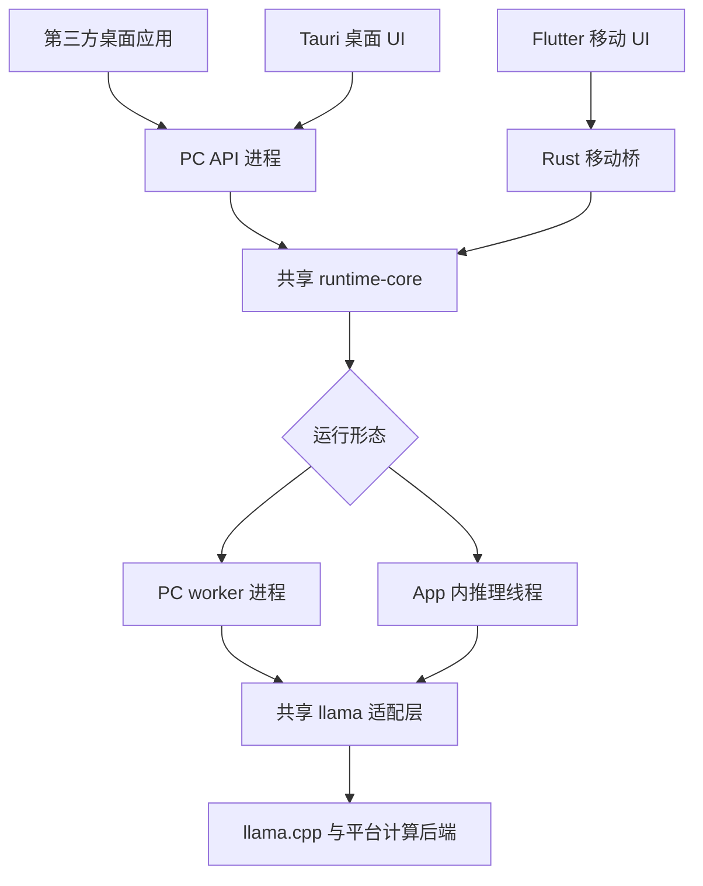
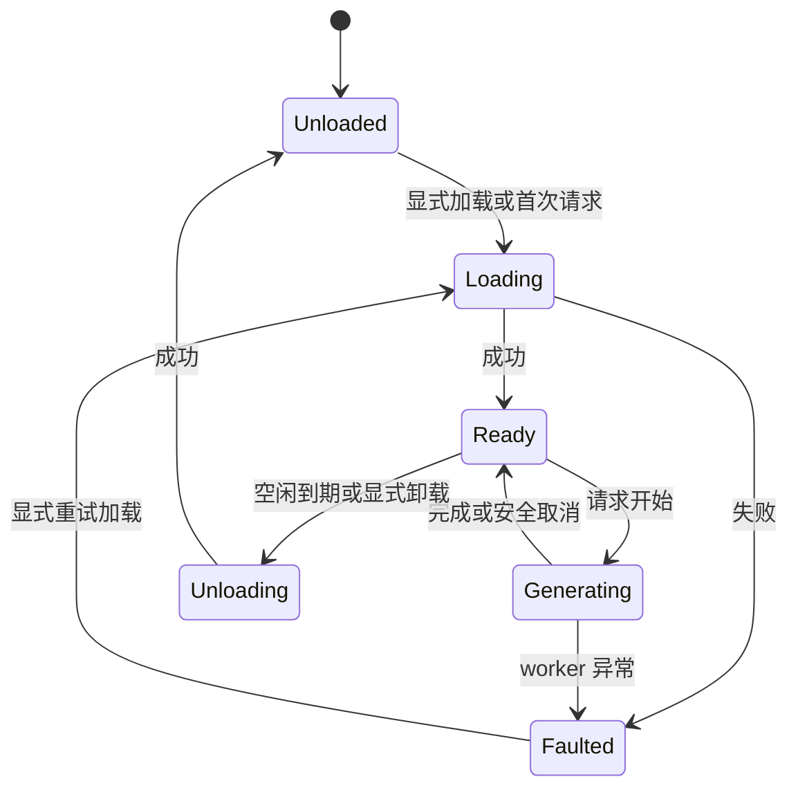

# Nexa Runtime v0.1 开发执行文档

- 版本：1.1
- 日期：2026-09-30
- 项目名：Nexa；命令与原生符号沿用 `ai-runtime` / `ai-runtime-worker` / `air_*`
- 文档对象：实现项目的开发者、编码 AI、验收人员

> 本文是可以据此分阶段开发和验收的实施规格，不是已经完成的软件。项目命令、接口和目录是需要实现的交付约定；本次文档导出没有编译项目、运行模型或做真机性能测试。上游能力已经参考官方资料核对，具体依赖版本在任务 T00 中锁定。

本文负责 runtime 的具体契约。项目总体边界见 [架构](docs/architecture.md)，首个业务见 [Telegram 摘要方案](docs/telegram-summary.md)，任务依赖见 [路线](docs/roadmap.md)，实际进度见 [当前状态](PROJECT_STATE.md)。v1.1 按 [ADR 0001](docs/decisions/0001-nexa-scope-and-layers.md) 同步项目定位与文档职责；未新增已实现能力或改变下述 HTTP 子集。

## 1. 目标与冻结决策

构建一个轻量的本地大模型运行时，让桌面应用通过本机 HTTP API 调用，让移动应用通过嵌入式库调用。第一版只接入 llama.cpp，复用模型管理、任务调度、推理适配和事件协议。

本项目首先为用户自己的 PC / Android 应用提供统一推理核心；首个业务验证是 Telegram 群消息摘要，同时保留本地聊天与短文本生成能力。UI 用于管理模型和验证能力，runtime 可以独立于 UI 使用。

Telegram 消息获取、来源快照、分块、摘要任务与产物属于调用层；runtime 只处理有界单次推理，不持久化聊天历史或自动执行摘要工作流。摘要任务 S00–S04 和业务质量验收独立于本文 T00–T10、A01–A26。

| 项目 | 第一版决定 |
|---|---|
| 核心语言 | Rust；C++ 仅用于 llama.cpp 适配层 |
| 推理引擎 | 固定 commit 的 llama.cpp，不跟随 master 自动升级 |
| 模型 | 本地单文件 GGUF，文本生成模型；按明确清单验收 |
| PC 形态 | Rust 常驻管理进程 + 按需启动的独立推理 worker |
| 移动形态 | 同一核心嵌入 App，专用原生线程执行推理 |
| PC UI | Tauri 2 + React + TypeScript + Vite |
| 移动 UI | Flutter；flutter_rust_bridge 2 作为 Dart/Rust 桥 |
| HTTP | Axum + Tokio，默认 `127.0.0.1:18080` |
| 外部接口 | `/v1/models`、`/v1/chat/completions` 的明确文本子集 |
| 并发 | 1 个加载模型、1 个运行任务、有限 FIFO 等待队列 |
| 对话历史 | 调用方提交完整 messages；runtime 不持久化聊天历史 |
| KV cache | 每个请求独立；第一版不跨请求复用 |
| 模型导入 | 复制本地文件到管理目录；不内置模型下载市场 |
| GPU | 按平台单独构建、按设备验证；CPU 始终作为基础路径 |
| NPU | 第一版不承诺，也不接入 MNN、QNN、CoreML、ONNX |

### 1.1 发布顺序

“统一 PC 和移动端”指统一核心源码、接口和可兼容的模型资产，不表示使用同一个二进制，也不表示所有平台共享后台服务生命周期。[S1][S2][S5]

| 发布层级 | 平台与范围 | 发布条件 |
|---|---|---|
| v0.1 必须完成 | Windows x64 CPU；Android arm64 CPU；PC HTTP；两端最小 UI | 两个平台真实模型与真机用例通过 |
| v0.1 GPU 扩展 | Windows CUDA / Vulkan，分别构建发行包 | 每个声明支持的后端有硬件验收记录 |
| v0.1.x 平台扩展 | Linux x64 CPU / Vulkan；macOS arm64 CPU / Metal | 独立构建、安装、推理、卸载验证通过 |
| 后续移动扩展 | Android Vulkan 设备清单；iOS arm64 CPU / Metal | 驱动、内存、前后台和签名打包验证通过 |

架构从第一天保留 Linux、macOS 和 iOS 适配边界；首个正式验收集中在 Windows 与 Android。没有设备实测的平台只能标注“构建通过”或“待验证”。

首批目标设备为用户提供的 Windows Intel i5-8400 / 16GB，以及 Android 骁龙 8E5 / 12GB；准确系统、手机型号和设备参数在 T00/T07 记录。这些信息不是模型容量或性能实测结论。

### 1.2 暂不实现

多模型同时运行、连续批处理、跨会话 KV 复用、分布式推理、工具调用、图片/音频、embedding、RAG、Agent、账号、云同步、模型市场、动态插件 ABI、远程公网服务、Android 常驻 HTTP 服务。

不把“Windows 小于 20 MB”“空闲固定 50 MB”“8B 模型固定使用 6 GB”作为既定事实。包体、内存、速度必须按模型、后端和设备分别实测。

## 2. 架构与职责



图中的共享核心表示代码复用：PC 进程和手机 App 各有自己的 runtime 实例。

| 模块 | 负责 | 不负责 |
|---|---|---|
| runtime-types | 请求、事件、错误、配置的数据类型与协议版本 | UI、原生指针 |
| runtime-core | 队列、任务取消、模型状态、超时、空闲卸载 | llama.h、HTTP、Flutter 类型 |
| model-store | 导入、校验、manifest、目录与原子写入 | 自动寻找和下载模型 |
| engine-host | 把核心操作映射到进程或嵌入式执行器 | 业务会话历史 |
| llama-adapter | 模板、分词、采样、prefill、decode、资源释放 | HTTP、App 页面 |
| runtime-api | 鉴权、请求验证、HTTP/SSE 映射 | 直接操作模型指针 |
| runtime-worker | IPC 控制、推理线程、原生崩溃隔离 | 公开监听端口 |
| runtime-mobile | Flutter 桥、App 生命周期通知 | 复制一份调度算法 |
| UI | 导入、选择模型、聊天、取消、状态和错误提示 | 自己拼接模型专用提示词 |

### 2.1 PC 进程

1. `ai-runtime serve` 启动 API、model-store 和调度器，不立即加载模型。
2. 加载时启动唯一 `ai-runtime-worker`；worker 包含 llama.cpp 原生依赖。
3. 父子进程使用私有 stdin/stdout 管道；日志只写 stderr。
4. API 进程不链接 llama.cpp，worker 崩溃不会直接带走 API 进程。
5. 空闲卸载完成后退出 worker；下一次请求按需重新创建。
6. API 退出时回收 worker；worker 发现父管道关闭后自行退出。Windows 打包时使用 Job Object 等平台机制防止遗留进程。

worker 崩溃属于模型运行失败，不自动重放已经输出一部分的请求。正在执行和排队的请求全部失败，状态转为 Faulted；用户显式 load 或重启服务后才能恢复。避免后台反复崩溃重启。

### 2.2 移动端执行

Flutter 通过 Rust 桥提交请求与接收事件。Rust 创建专用推理线程，线程内部创建并独占原生资源。HTTP、PC IPC 和子进程管理不编入移动包。

第一版 Android 前台文本生成；App 进入后台即发出取消，任务安全结束后卸载。系统终止进程后不自动恢复未完成生成。原生层崩溃仍可能导致 App 退出，Rust 不会自动消除 FFI 内部的崩溃风险。摘要调用层如保存已完成阶段，须显式创建新的推理请求继续；不因此承诺后台定时摘要。

## 3. 工程目录与依赖边界

以下路径从项目根目录算起；是需要创建的仓库结构。

| 路径 | 内容 |
|---|---|
| `Cargo.toml`、`Cargo.lock` | Rust workspace 与锁文件 |
| `rust-toolchain.toml` | 精确 Rust 工具链版本 |
| `crates/runtime-types/` | 类型、事件、错误和序列化 |
| `crates/runtime-core/` | 调度器、生命周期、资源策略 |
| `crates/model-store/` | GGUF 导入与 manifest 管理 |
| `crates/engine-host/` | PC 进程执行器与移动嵌入执行器 |
| `crates/llama-adapter/` | Rust 安全封装及 native 构建入口 |
| `crates/runtime-api/` | Axum 路由、鉴权、SSE |
| `crates/runtime-worker/` | `ai-runtime-worker` 二进制 |
| `crates/runtime-cli/` | `ai-runtime` 二进制 |
| `crates/runtime-mobile/` | Flutter 桥的受控导出模块 |
| `native/llama-shim/` | 自有 C ABI 头文件、C++ 适配、CMake |
| `vendor/llama.cpp/` | 固定 commit 的 Git submodule |
| `apps/desktop/` | Tauri + React 应用及前端锁文件 |
| `apps/mobile/` | Flutter 应用及 pubspec.lock |
| `xtask/` | 构建、打包、验收命令 |
| `tests/contract/` | HTTP、SSE、IPC、错误协议测试 |
| `tests/fixtures/` | 小型输入文本、畸形文件；不提交大型模型 |
| `docs/build-lock.md` | 工具版本、llama commit、构建选项、设备信息 |
| `docs/model-matrix.md` | 支持模型、GGUF SHA-256、模板与验证结果 |
| `docs/decisions/` | 需要改变本规格的技术决策记录 |
| `artifacts/verification/` | 测试与性能报告，不提交聊天正文 |

依赖方向：types 被其他模块引用；core 仅依赖类型、存储接口和执行器接口；API、CLI、mobile 作为组装入口。llama.cpp 类型不能泄漏到 core。

技术依赖冻结：Tokio、Axum、Serde、thiserror、tracing、Clap、SHA-256 实现、平台数据目录库。只按实际用途引入依赖，不预先加入数据库、gRPC、WebSocket、插件系统。

Flutter bridge 只导出 `runtime-mobile/src/api/` 下明确标记的接口；llama-adapter 内部函数不在生成器扫描范围内。生成代码提交版本控制；改变导出时重新生成并检查差异。[S8]

## 4. llama.cpp 集成规格

### 4.1 选择库集成

最终产品使用 llama.cpp 库和自有轻量 C++ 适配层。上游 server 用作基线对照，不作为移动运行时，也不与自有 API 形成两套生产实现。

llama.cpp 提供 C API；复杂聊天模板还需要关注同版本的 common/chat 辅助实现。不能把所有模型的 messages 简单拼成一段字符串。第一版在 C++ shim 内使用锁定版本的模板辅助代码，封装其 C++ 依赖。[S3][S4]

### 4.2 C ABI 边界

下面是本项目接口名称与语义约定，不是上游已有函数签名。T01 要把它们落实成 `native/llama-shim/include/air_llama.h`。

| 操作 | 语义 |
|---|---|
| `air_engine_create/destroy` | 初始化/释放当前进程的引擎资源 |
| `air_model_load/unload` | 加载 GGUF、模板与上下文；释放时遵守依赖顺序 |
| `air_prepare` | 应用模板、分词、计算准确 prompt token 数；返回不透明 prepared handle |
| `air_prepared_free` | 未执行或被取消时释放 prepared handle |
| `air_generate` | 消费 prepared handle，以回调返回生成事件 |
| `air_cancel_create/set/destroy` | 创建、设置、释放独立取消标志 |
| `air_buffer_free` | 释放由 shim 分配并返回的缓冲区 |
| `air_get_build_info` | commit、编译后端、shim 协议版本 |

约束：

- ABI 使用固定宽度整数、不透明句柄、`pointer + length`；不跨边界传 `std::string`、Rust `String` 或 STL 对象。
- fallible 操作返回固定宽度状态码（0 表示成功）和显式 error 输出；失败输出不携带可用句柄。错误文本按同一缓冲区释放规则处理，不依赖跨线程的全局 last_error。
- 明确每个缓冲区由谁分配、谁释放；跨边界字符串为 UTF-8，Windows 文件打开需正确转换原生路径。
- 回调期间数据只借用；Rust 必须在回调返回前复制需要保留的内容。
- C++ 异常在 shim 捕获并转错误；Rust 回调不得 panic 穿越 C ABI。
- engine、model、context、sampler 全部在同一推理线程创建和释放；禁止为方便编译盲目添加 `unsafe impl Send/Sync`。
- 只有取消标志允许并发访问，它的存活时间覆盖整个 load/generate 调用。取消通道不排在正在执行的生成任务后面。
- 释放顺序：prepared / sampler → context → model → 引擎。所有失败路径也执行清理。

### 4.3 一次推理的固定流程

1. Rust 检查请求结构、长度、参数和当前模型。
2. 请求获得运行槽位后，shim 按模型模板格式化完整 messages。
3. 按模型 tokenizer 规则处理 special token、BOS/EOS；不重复加入。
4. `air_prepare` 计算 prompt token 数并检查上下文预算；失败时尚未开始 SSE 正文。
5. 清空该次请求之前的 KV 与采样状态，创建本次 sampler。
6. 分批 prefill，每批之间检查取消、截止时间与输出消费者状态。
7. 逐步 decode，按 sampler 采样，判断终止 token、用户 stop 和输出预算。
8. 增量重组 UTF-8，处理跨 token 的 stop 字符串，再向上层发布文本增量。
9. 输出一个终态事件和实际 token 统计，销毁 sampler/prepared，清理请求 KV。

上下文预算规则：`prompt_tokens + max_tokens <= context_size`。prompt_tokens 必须包含模板和特殊 token。第一版不静默截断历史，不自动摘要，也不开启上下文滑动。

### 4.4 模型与模板范围

最初用 Qwen3 系列小型 GGUF 验证链路，例如 0.6B；业务质量可比较 1.7B 与 4B。量化选择以实际可获取并锁定的文件为准，可对照 Q8_0、Q4_K_M 等配置，不假定每个官方仓库都有相同量化文件。这些是候选验证配置，不是本文件已经验证的产品支持清单。

T00/T01 必须在 model-matrix 中记录精确来源、模型修订、量化格式、文件 SHA-256、GGUF 架构、模板校验和、默认上下文、支持平台及许可证信息。支持能力按这一组合认定，不能用“所有 GGUF 都支持”替代。

第一版只发布非思考聊天模式：对模板支持关闭思考的已验收模型，在模型配置中固定关闭。上游当前模板辅助层包含思考开关，但不同版本和模板需要验证。[S4]

不在用户输入尾部私自拼接控制词；不对输出做通用正则删除 `<think>`。如果关闭思考仍不能稳定得到预期聊天输出，该组合不能进入第一版正式清单。

缺失/不支持的模板返回 `unsupported_chat_template`；未验收架构返回 `unsupported_model`。GGUF magic 正确不代表模型可以成功加载。

## 5. 模型、配置与资源

### 5.1 数据目录

桌面端使用平台用户数据目录；支持 `--data-dir` 显式覆盖。Android 使用 App 私有持久目录，不使用易被系统清理的缓存目录。

| 相对路径 | 用途 |
|---|---|
| `config.toml` | runtime 配置 |
| `secrets/api-token` | PC 本地 API 令牌，只允许当前用户读取 |
| `models/<model_id>/model.gguf` | 管理后的模型文件 |
| `models/<model_id>/manifest.json` | 模型元信息与校验结果 |
| `imports/<import_id>.partial` | 导入中的临时文件 |
| `logs/` | 轮换日志 |
| `runtime/` | 实例锁和运行时发现信息 |

`model_id` 限制为 `[a-z0-9][a-z0-9._-]{0,63}`。HTTP 模型字段只接收已注册 ID，不接收文件路径。

导入顺序：检查空间和来源可读 → 复制到临时文件并计算 SHA-256 → 检查 GGUF / manifest → 在同文件系统原子移动 → 更新索引。失败清理 `.partial`。默认不覆盖同名模型；删除注册项不删除用户原始文件。

Android 通过系统文件选择器取得 URI，使用 ContentResolver 打开输入流，复制到 App 私有目录；不能把 `content://` 当普通路径传给 C++。[S2]

manifest 至少包含：schema_version、id、display_name、relative_file、size_bytes、sha256、source、architecture、quantization、template_sha256、context_limit、default_context、validated_llama_commit、capabilities。未知字段可保留；缺失关键校验字段不标记为已验证。T02目录原子提交、Windows保留文件名限制和验证缓存决策见 [ADR0003](docs/decisions/0003-t02-scheduler-storage-and-observability.md)，不改变公共model_id语法。

### 5.2 默认配置

此配置是产品默认值，后续性能测试可以通过决策记录调整。

```toml
schema_version = 1

[api]
listen = "127.0.0.1:18080"
max_body_bytes = 1048576
token_file = "secrets/api-token"

[runtime]
max_active_models = 1
max_running_jobs = 1
max_queued_jobs = 8
queue_timeout_seconds = 120
execution_timeout_seconds = 300
load_timeout_seconds = 300
idle_unload_seconds = 300
cancel_grace_seconds = 5

[inference]
backend = "cpu"
context_size = 4096
max_output_tokens = 512
temperature = 0.7
top_p = 0.9
gpu_layers = 0
```

Android 覆盖默认值：context_size=2048、max_output_tokens=256、max_queued_jobs=1、idle_unload_seconds=60。execution_timeout 包含 prepare/prefill/decode，不包含排队和模型加载；三类计时分别记录。

`backend`、`context_size`、`gpu_layers` 是 load-time 参数；修改后需要卸载并重新加载。`max_output_tokens` 是请求未提供输出预算时的默认值，不是无条件可用的剩余上下文。

### 5.3 设备选择

设备状态至少分开报告：`compiled`、`driver_available`、`probed`、`validated`、`selected`。检测到 GPU 不代表模型已经使用 GPU。

默认从 CPU 起步。GPU 发行包允许选择其对应后端；`auto` 只在已安装且已经该设备验证的候选中选择。第一版不根据显卡名称自动决定模型大小，不根据 TOPS 推导模型容量。

手动指定 CUDA/Vulkan/Metal 失败就返回可读错误。auto 允许在尚未开始生成时尝试 CPU 一次，状态必须显示回退原因；已经输出文本的请求不得自动从头生成。

内存预算包含权重、KV cache、计算缓冲、运行时与 UI。内存不足时优先提示减少上下文或使用更小模型；不在用户不知道的情况下改变模型、量化或历史内容。

空闲计时只在无活动任务、无排队任务时启动。计时器触发与新请求到达由调度器串行决定，禁止卸载正在推理的 context。

## 6. 调度、状态与取消

### 6.1 模型状态



队列独立于模型状态存储。一个调度器 actor 负责所有状态转换，不使用多个互相竞争的全局互斥锁控制加载与卸载。

- selected_model 初始为空；首次有效请求可选择已注册模型并触发加载。
- selected_model 已确定后，其他模型请求返回 409 `model_conflict`，不自动挤出当前模型。
- 空闲卸载保留 selected_model 与加载参数；下一次同模型请求可重新加载。
- 显式 load 可以在没有运行或排队任务时更换模型；有任务时返回 409 `runtime_busy`。
- 同模型、同参数重复 load 为幂等操作；显式 unload 同样要求任务全部结束。
- 重启 runtime 后 selected_model 为空；不恢复旧任务。
- 加载失败使当前批次任务失败；不能让后续请求无限等待。Faulted 只接受查询、关停或显式 load 重试。

### 6.2 请求状态与事件

请求状态：`Queued → Preparing → Running → Completed / Cancelled / Failed`。Preparing 可以包含按需加载、模板格式化和分词。

公共事件至少包括：Accepted、Queued、Loading、Started、TextDelta、Completed、Cancelled、Failed。每个事件带 `request_id`、单调递增的 `seq`；每个请求只能有一个终态。Started 表示模型已准备好、token 预算通过，此时才可开始正常 SSE 响应。

这些事件是 core/移动桥的公共语义；HTTP 按第 7 节映射，Started 前不提供正常 SSE。当前 status 只有聚合状态和活动 ID，不承诺全量排队事件或断线重放；更细的请求观察契约在 S01 明确后另行同步。

请求 ID 使用 UUID。调用方可提供 `X-Request-ID`，服务校验格式并拒绝当前仍存在的重复 ID；未提供则生成。ID 同时出现在 HTTP 响应头、日志、状态事件中。UI 自行生成 ID，以便响应头尚未返回时也能取消。

等待队列 FIFO，容量不包含当前运行槽。PC 最多 1 个活动请求 + 8 个等待请求。请求体先受大小限制再入队；记录进入队列的时间，超过 queue_timeout 即失败。

首个请求预留活动槽后加载模型，同模型后续请求排队。取消最后一个需求方时应尽力终止加载；某个等待方取消不能打断其他任务需要的加载。

### 6.3 取消与背压

取消来源：UI 停止按钮、HTTP 客户端断开、显式取消接口、超时、移动 App 后台事件、消费者停止读取。

1. 取消等待任务：移出队列并发布 Cancelled，不加载模型。
2. 取消运行任务：控制通道立即设置原子标志；推理循环在 prefill 批次间和 decode 步骤间检查。
3. 原生 abort 回调仅在锁定后端确实支持时使用；不能承诺任何 GPU 内核都能立即中断。官方当前 C 头文件对相关回调标有 CPU 执行限制。[S3]
4. PC 超过 5 秒仍未结束时，父进程终止 worker，当前请求为 Cancelled，其余请求因 worker 重置失败，进入 Faulted；必须显式重新 load。
5. 移动端不强杀正在执行原生代码的线程，也不释放仍被使用的指针。UI 显示“正在停止”，等待原生调用返回；长期无响应属于待修复的后端问题，不宣称取消已完成。

事件缓冲有界：每请求最多 256 KiB 待发送文本，单个 delta 最多 4 KiB，按 UTF-8 字符边界切分。缓冲超过上限且 10 秒没有消费进展，取消为 `slow_consumer`。不能为了发布终态继续无限等待一个已经阻塞的消费者。T02以一个共享预算计入执行器、actor和消费队列的全部在途文本；短delta可保守计费以同时约束事件开销。原生同步回调只允许在decode步骤之间有界、可取消等待；活动槽仍保留到原生调用安全返回。

一般设备上的交互目标：UI 立即响应停止操作，CPU 小模型取消通常应在 1 秒内完成；这是验收目标，必须记录实测。GPU 取消延迟单独报告。

### 6.4 PC IPC

使用逐行 JSON（NDJSON），每帧一行，字符串内换行由 JSON 转义。帧带 protocol_version、kind、request_id、payload；事件另带 seq。

- 请求帧上限 2 MiB，事件帧上限 64 KiB；超限/畸形帧触发协议错误并回收 worker。
- 启动先交换 Hello，核对 protocol、shim 与 llama commit；不匹配则拒绝执行。
- worker 的管道读取/控制线程独立于推理线程，Cancel 不等待 Generate 返回。
- stdout 只用于协议，llama 和 Rust 日志全部重定向到 stderr。
- 写事件采用有界队列及可取消写入；stdout 阻塞不得阻塞读取取消命令。
- EOF、破损帧、worker 异常退出都要让所有受影响的请求收到一次终态。

## 7. HTTP 与客户端契约

### 7.1 兼容边界

本产品只声明下表中的 Chat Completions 文本兼容子集。上游自己的 server 也未保证完整 OpenAI API 兼容，因此不能把“提供同名路由”等同于所有第三方软件无修改接入。[S6]

| 路由 | 行为 |
|---|---|
| `GET /healthz` | 无鉴权，仅返回 API 进程是否存活；不暴露模型/路径 |
| `GET /v1/models` | 已注册且可供使用的模型，标准 list/data 结构 |
| `POST /v1/chat/completions` | 文本 messages，流式或非流式 |
| `GET /runtime/status` | 模型状态、队列数、活动 ID、后端、错误与内存指标 |
| `GET /runtime/devices` | 本构建后端与设备探测结果 |
| `POST /runtime/models/import` | 当前用户本地文件导入；只供受信任本机管理客户端 |
| `POST /runtime/load` | 显式加载/切换，完成后返回 200；受 load_timeout 约束 |
| `POST /runtime/unload` | 无任务时卸载，返回最终状态 |
| `POST /runtime/requests/{id}/cancel` | 标记取消；存在活动请求返回 202，未知 ID 返回 404 |
| `POST /runtime/shutdown` | 停止接收新请求、取消任务、回收 worker、退出 |

所有 `/v1/*` 和 `/runtime/*` 使用 `Authorization: Bearer <token>`。只接受本机回环连接；v0.1 不提供 `0.0.0.0` 监听开关。令牌由 init 生成，日志不得输出，读取权限限当前用户。

HTTP 默认不启用浏览器跨域访问；有 Origin 的请求只允许明确配置的可信来源，并验证 Host。桌面 UI 通过 Tauri Rust 命令代理调用本机 API，令牌不进入前端脚本。不要用允许任意 origin 的 CORS 设置解决 UI 接入问题。

### 7.2 Chat 请求字段

| 字段 | 第一版规则 |
|---|---|
| `model` | 必填，已注册 ID |
| `messages` | 必填，1–128 条；role 为 system/user/assistant；content 为字符串 |
| 消息顺序 | 至多一个 system 且在首位；随后 user/assistant 交替；最后为 user |
| `stream` | 默认 false |
| `max_tokens` | 1–4096，默认由配置给出；仍受模型上下文余额约束 |
| `max_completion_tokens` | max_tokens 的别名；两者同时出现则返回 400 |
| `temperature` | 0–2，默认 0.7；0 使用 greedy 路径 |
| `top_p` | 大于 0 且不大于 1，默认 0.9 |
| `seed` | 可选，非负 32 位整数；只承诺同环境尽力复现 |
| `stop` | 可选，字符串或最多 4 个非空字符串；每个最多 128 个 UTF-8 字节 |
| `n` | 仅允许省略或 1 |
| `stream_options.include_usage` | 允许；只对 stream=true 有效 |
| `user` | 可接收的标识，长度限制 128 字符；不写入默认日志，不参与调度 |

不支持的已知功能字段（如 tools、tool_choice、response_format、logprobs、非零 penalties、多模态 content）返回 400 `unsupported_parameter`，不得静默忽略。frequency_penalty/presence_penalty=0、logprobs=false、tool_choice="none" 可作为兼容空操作接受。其他未知字段返回 400，并指明字段名。

第一版没有 developer/tool 角色、Responses API、会话恢复或服务端聊天历史。接入第三方客户端时关闭工具调用等超出范围的功能，并单独记录兼容测试结果。

群消息摘要将来源记录序列化为待分析的 user 内容，不将每位群成员映射为 assistant。调用层分块所需的模型能力、精确 token 预算查询目前属于 S01 契约设计任务；内部 air_prepare 不是已经发布的计数 API，具体扩展须记录 ADR 并同步两种宿主。

### 7.3 请求与非流式响应示例

```json
{
  "model": "qa-small",
  "messages": [{"role": "user", "content": "用一句话介绍本地 AI。"}],
  "max_tokens": 128,
  "temperature": 0.7,
  "stream": false
}
```

```json
{
  "id": "chatcmpl-7d0d3c16-9280-4f48-b50e-b26136ad4990",
  "object": "chat.completion",
  "created": 1790640000,
  "model": "qa-small",
  "choices": [{
    "index": 0,
    "message": {"role": "assistant", "content": "本地 AI 在你的设备上运行模型。"},
    "finish_reason": "stop"
  }],
  "usage": {"prompt_tokens": 20, "completion_tokens": 15, "total_tokens": 35}
}
```

示例时间戳、token 数和回复仅示范格式；实现必须使用实际统计。prompt_tokens 包括模板 token；completion_tokens 包括生成过程中采样的终止/stop token，文本字符数不能代替 token 数。

### 7.4 SSE

HTTP 设置 `Content-Type: text/event-stream`、禁用响应缓冲；每条数据以空行结束。所有 chunk 的 id、created、model 保持一致。

```text
data: {"id":"chatcmpl-example","object":"chat.completion.chunk","created":1790640000,"model":"qa-small","choices":[{"index":0,"delta":{"role":"assistant"},"finish_reason":null}]}

data: {"id":"chatcmpl-example","object":"chat.completion.chunk","created":1790640000,"model":"qa-small","choices":[{"index":0,"delta":{"content":"你好"},"finish_reason":null}]}

data: {"id":"chatcmpl-example","object":"chat.completion.chunk","created":1790640000,"model":"qa-small","choices":[{"index":0,"delta":{},"finish_reason":"stop"}]}

data: [DONE]

```

正常结束 reason 为 stop 或 length。请求 include_usage=true 时，在 finish chunk 与 [DONE] 之间发送 choices=[] 的 usage chunk；统计字段与非流式一致。

发出 SSE 响应前完成排队、加载、模板和上下文预算检查，错误可使用对应 HTTP 状态。等待期间客户端 read timeout 应覆盖排队、加载和首 token 处理，不以服务暂未返回正文判定卡死。

SSE 已开始后出错，发送一个 `data: {"error":{...}}` 事件后关闭连接，不发送成功 finish 或 [DONE]。这是本产品的错误扩展，客户端必须处理。显式取消也按此路径返回 `request_cancelled`；客户端断开时无需向断开的连接发送终态。

stop 检测必须保留可能跨 chunk 匹配的尾部，命中的 stop 文本不发送给客户端。中文/emoji 的 UTF-8 片段必须完整再发送，不能逐 token 独立强制解码而产生替代字符。

### 7.5 错误映射

```json
{"error":{"message":"输入与输出预算超过模型上下文。","type":"invalid_request_error","param":"messages","code":"context_length_exceeded"}}
```

| 状态码 | code 示例 |
|---|---|
| 400 | invalid_request、unsupported_parameter、unsupported_chat_template、unsupported_model、context_length_exceeded |
| 401 | invalid_api_key |
| 404 | model_not_found、request_not_found |
| 409 | model_conflict、runtime_busy、duplicate_request_id |
| 408 | request_cancelled（仅请求尚未进入 SSE 且连接仍在时） |
| 413 | request_too_large |
| 429 | queue_full；带 Retry-After |
| 503 | model_load_failed、insufficient_memory、backend_unavailable、runtime_faulted、worker_lost |
| 504 | queue_timeout、load_timeout、execution_timeout |
| 500 | internal_error；不向客户端暴露原始文件路径与栈 |

runtime/models/import 的成功结果至少包括 id、size_bytes、sha256。runtime/load 请求至少包括 model、backend、context_size、gpu_layers；未提供的加载参数来自配置。管理操作的忙碌判断与调度器在同一处完成。

## 8. CLI 与两端 UI

### 8.1 CLI 契约

统一可执行文件名为 `ai-runtime`；Windows 带 `.exe`。全局 `--data-dir` 在子命令前使用。

| 命令 | 行为 |
|---|---|
| `init` | 创建配置与令牌；重复执行不重置已有值 |
| `serve` | 前台运行，Ctrl+C 优雅退出；不偷偷创建系统服务 |
| `models import --id ID --file PATH` | 导入本地模型 |
| `models list` | 列出模型与验证状态 |
| `load ID --backend cpu --context 4096` | 加载或切换模型 |
| `unload` | 卸载 |
| `status`、`devices` | 查询状态与设备 |
| `cancel UUID` | 取消一个请求 |
| `stop` | 调用 shutdown 并等待服务退出 |
| `version --json` | 项目版本、协议、构建信息；运行中可补充 worker 信息 |

服务未运行时，init/import/list 在持有数据目录锁的情况下操作本地数据。服务已运行时，import/list 和其他管理操作通过 API，避免两个进程同时改 manifest。第二个 serve 必须因实例锁或端口冲突清晰失败。

### 8.2 PC UI

三个页面足够：模型、聊天、设置。

- 模型页：选择 GGUF、导入进度、模型状态、加载/卸载、实际运行后端。
- 聊天页：消息列表、输入框、流式回复、停止、清空。第一版历史仅在当前 UI 会话内保存；清空不影响其他客户端。
- 设置页：后端、上下文、默认输出预算、空闲卸载时间、本机 API 地址与复制令牌入口。
- 无模型、加载中、正在停止、模型错误都有明确可恢复状态。

Tauri 后端发现已有匹配协议的 runtime 则连接；否则从应用随包路径启动。关闭 UI 默认保留 runtime，可在设置中选择“同时退出”；退出 runtime 需要关闭所有任务。外部二进制按平台打包并限制可执行命令，使用 Tauri 的 sidecar/原生进程能力实现。[S9]

UI 不周期性轮询整个日志；状态更新最多每秒一次，文本事件批量合并到约 30 次/秒以内刷新，避免逐 token 重绘整个聊天列表。

### 8.3 Android UI

三个界面：模型导入、聊天、运行设置。Dart 通过 bridge 订阅公共事件，不直接持有 llama 指针。桥接入口只负责初始化、导入、加载、生成、取消、状态和生命周期通知。

进入后台取消并在安全点卸载；返回前台显示“模型未加载”，由下次发送触发加载。不在本版启动前台服务，不公开本机端口，不申请无关存储权限。

模型复制会暂时占用额外空间，UI 在导入前展示文件大小和目标位置。大文件复制、SHA-256、tokenizer 与推理全部离开 UI 线程。

Flutter 的推理事件流订阅不代替取消句柄：初始化得到 runtime handle，每次 generate 使用独立 request_id；关闭流订阅也要向 core 发取消。桥只导出可序列化的自有类型和受控不透明句柄，错误映射为公共错误码，不把 C++ 异常或裸指针直接交给 Dart。

## 9. 构建、发行与版本锁定

### 9.1 T00 必须锁定的内容

| 项目 | 保存位置/要求 |
|---|---|
| Rust | rust-toolchain.toml 精确版本；Cargo.lock 提交 |
| llama.cpp | submodule 精确 commit；不能只有分支名 |
| C/C++ | Windows MSVC、CMake、Ninja 的版本；统一运行库设置 |
| 桌面前端 | Node、包管理器精确版本；前端锁文件；Tauri 版本 |
| 移动 | Flutter SDK、Dart、bridge/codegen、JDK、Gradle、NDK 版本 |
| 模型 | 来源、revision、文件 SHA-256、模板 hash、量化 |
| 平台 | OS 版本、ABI、最低版本、GPU 驱动与构建选项 |

本文件不编造一个尚未实际构建验证的 llama commit。T00 的交付条件就是补齐这些值，并证明固定的组合可以构建。依赖下载可以在开发环境发生；发布后的文本推理不依赖联网。

### 9.2 编译边界

- `engine-host/process` 只编译 IPC 客户端，不依赖 llama 原生库。
- `engine-host/embedded` 引入 llama-adapter，供移动端使用。
- worker 的 backend-cpu/cuda/vulkan/metal 功能按目标构建；GPU 功能仍保留 CPU 路径。
- 构建脚本仅从锁定 vendor 源码构建，不在 build.rs 中执行 git pull 或下载未知二进制。
- x64/arm64 发布包不能直接使用构建机的全部本机指令集。关闭隐式 native 优化，并验证选定的基础指令集；不要假定单个开关等于兼容所有旧 CPU。
- CMake 在独立目录构建，Release 与 Debug 分离。Windows Rust/C++ ABI、运行库和链接配置一致。
- 不使用 `--all-features` 构建所有互斥 GPU 后端；xtask 根据目标选择特性。

llama.cpp 的 CUDA、Vulkan、Metal 等构建路径分别维护；具体 CMake 选项以锁定版本为准。[S1][S7]

Android 初始 ABI 为 arm64-v8a、minSdk=28；targetSdk 和 NDK 根据锁定的 Flutter 与发行要求记录。验证 native 库打包、动态依赖、目标设备页大小和指令集，不仅检查 APK 是否生成。CPU 通路稳定后才增加 Vulkan。

### 9.3 发行包

| 产物 | 内容 |
|---|---|
| `windows-x64-cpu` | CLI/API、CPU worker、必要运行依赖、配置示例、许可证 |
| `windows-x64-cuda` | 对应 CUDA worker 与实际需要的运行库，单独统计大小 |
| `windows-x64-vulkan` | 对应 Vulkan worker 与依赖 |
| `desktop-windows` | Tauri UI + 匹配架构的 runtime 包 |
| `android-arm64` | Flutter APK/AAB + Rust/llama 原生库；不内置模型 |
| 后续平台包 | 依照同样原则独立构建、签名和验证 |

第一版采用整包发行，无运行时自动下载加速插件。模型独立导入。符号文件另外保存，不混入普通用户包。

包体报告分别列出：压缩下载大小、安装大小、UI、runtime、原生运行依赖、模型大小。Windows WebView 运行环境存在与否也要写清；不把外置运行库当成不存在的成本。

## 10. 可执行开发任务

按照依赖推进，编号不要求 Windows UI 完成后才做 Android。T01 可提前安排 Android 构建探针；T02 后优先尽早开展 T07，完整真机验收仍不可省略。允许在完成依赖后穿插 UI 工作，但不能用 UI 截图替代模型运行验收。每个任务单独交付可审查变更与验证记录；Git 初始化后按项目指引提交。

| ID | 前置 | 必须交付 | 完成判据 |
|---|---|---|---|
| T00 锁定基线 | 无 | workspace、构建锁、模型清单、xtask 框架、上游基线报告 | 固定 llama commit 在 Windows CPU 运行候选小模型；保存真实输入和统计 |
| T01 原生链路 | T00 | C ABI、Rust 封装、模板/prefill/decode/sampler、取消 | 不经过 UI/HTTP，真实 GGUF 完成中英文流式生成；重复加载释放；特殊 token 正确 |
| T02 存储与调度 | T01 | 导入、manifest、队列、状态机、deadline、空闲卸载 | 并发、切换模型、队列超限、取消和资源回收通过 A05–A12 |
| T03 PC worker | T02 | 进程执行器、NDJSON、握手、崩溃与退出处理 | 杀掉 worker 时 API 存活且所有受影响请求终结；无遗留进程 |
| T04 HTTP/CLI | T03 | 第 7/8 节接口、SSE、令牌、CLI；xtask api-smoke | curl 非流式/流式和错误用例通过；两客户端串行执行 |
| T05 Windows 发行 | T04 | CPU 便携包、依赖清单、安装说明 | 无开发工具的验收机可启动并运行已导入模型 |
| T06 PC UI | T05 | 模型、聊天、设置；runtime 发现/启动/退出 | UI 可完成导入、聊天、停止；UI 关闭后 API 按设置继续服务 |
| T07 Android 核心 | T02 | 移动构建、Rust 桥、生命周期、原生线程 | Android 真机运行真实模型；复用 core/adapter，无重复调度实现 |
| T08 Android UI | T07 | 文件导入、流式聊天、取消、状态、APK | 飞行模式运行；后台取消；恢复前台不重放旧任务 |
| T09 发布验收 | T06、T08 | contract-tests、平台 smoke、性能/包体报告、支持矩阵 | 所有 v0.1 必须用例通过；跳过项不能写成通过 |
| T10 GPU/平台扩展 | T09 | 每个后端/平台独立包与报告 | 对应设备测试通过，才将组合列入支持矩阵 |

T00 的上游基线用该固定版本附带的 CLI/server/bench 工具，命令来自该版本 `--help`，记录在 build-lock。上游命令名称和参数可能变化，不把本文中的自有项目命令误用于 llama.cpp。

### 10.1 AI 执行规则

每个任务开始前阅读本文对应章节、上一任务结果、相关文件。优先完成一个可运行的纵向功能，再增加覆盖平台。不要只创建空 trait、空页面或模拟回复就报告“核心完成”。

每个任务结束时交付：

1. 修改范围与任务编号。
2. 真实执行的命令和退出码。
3. 相关测试用例 ID 与结果。
4. 运行所用模型 hash、后端和设备；无真实模型时明确写“未验证推理”。
5. 剩余问题与下一任务所需信息。

允许在调度/协议单元测试中使用 fake backend；fake 必须仅在测试或显式开发构建启用，不能替代发行验收。没有 Android 真机时可以完成交叉编译，但 T07/T08 真机验收保持未完成。

改变接口、默认行为、数据目录或目标平台时写入 docs/decisions，说明原因和迁移方式。依赖升级和功能开发分开验证，不能为解决编译报错悄悄追随上游 master。

## 11. 验收矩阵

下面用例由 T01–T09 逐步实现。协议/状态类可自动化，真实推理和生命周期必须包含设备验证。

| ID | 测试 | 预期 |
|---|---|---|
| A01 | 导入可用模型，提交单轮中英文文本 | 实际生成、无固定模拟回复、usage 合理 |
| A02 | 多轮完整 messages 与首条 system | 模板正确、历史顺序正确；不同请求互不污染 |
| A03 | stream=false / true | 非流式结构、SSE role/delta/finish/[DONE] 正确 |
| A04 | UTF-8 跨 token；stop 跨 chunk | 中文/emoji 不破碎，stop 不泄漏，终态一次 |
| A05 | 模板后 token 数 + 输出预算超限 | 400 context_length_exceeded，无静默截断 |
| A06 | PC 同时 1 个活动 + 8 个等待，再提交第 10 个 | FIFO；第 10 个返回 429；统计一致 |
| A07 | 取消队列中的任务 | 不调用模型，不影响其他请求 |
| A08 | prefill 和 decode 阶段分别取消 | 有界响应；无重复终态；报告取消耗时 |
| A09 | 断开客户端或让消费者持续不读取 | 推理停止，缓冲不无限增长，下一请求可执行 |
| A10 | 正在生成或排队时切换/卸载 | 409，无 use-after-free |
| A11 | 空闲卸载与新请求在边界同时发生 | 状态一致；请求安全完成或重新加载 |
| A12 | 队列/加载/执行分别触发超时 | 对应错误码、清理资源，不永久占用槽位 |
| A13 | 强制结束 worker | API 仍存活；任务失败；Faulted；显式 load 可恢复 |
| A14 | API Ctrl+C / stop / 父进程异常退出 | 正常路径回收 worker；异常路径无长期遗留进程 |
| A15 | 损坏 GGUF、缺模板、不支持架构 | 清晰错误，API 不崩溃，无无限重试 |
| A16 | 内存不足或 GPU 加载失败 | 正确错误/明确回退，已输出请求不自动重放 |
| A17 | 无令牌、错误令牌、外部来源、超大 body | 拒绝；正文和令牌不进入默认日志 |
| A18 | 重复 request_id、畸形 IPC、协议版本不匹配 | 稳定错误，无任务混淆 |
| A19 | 100 次短请求、20 次加载/卸载 | 无崩溃；请求终态完整；检查长期内存趋势 |
| A20 | 未安装开发工具的 Windows 验收机 | 包内依赖齐备，CPU 路径离线运行 |
| A21 | Android URI 导入中断、空间不足 | 不留下已注册的半文件，原文件不损坏 |
| A22 | Android 前后台切换、重建 UI、系统结束 App | 不后台无限生成；不复用已销毁句柄 |
| A23 | Android 连续生成 15 分钟 | 记录热降频、内存和速度，无 UI 线程阻塞 |
| A24 | PC 两个应用同时调用相同模型 | 串行正确；历史不共享；队列和取消互不串线 |
| A25 | GPU 构建在指定硬件运行 | 日志/状态证明实际使用后端，记录 CPU 对照 |
| A26 | 模型卸载前后内存与显存 | 记录实际释放；不能把 OS 文件缓存误报为泄漏 |

A19 的报告区分权重 mmap、进程私有内存、驱动缓存与 GPU 分配。预热后若仍持续增长必须定位；不要求 OS 工作集立即归零。

至少包含一项真实模型端到端自动 smoke。对输出不做跨后端逐字相同断言；断言协议、预算、非空有效文本、终止和资源状态。只有固定环境的受控基线才做细粒度 token 对比。

## 12. 验证命令与操作步骤

> 以下是项目必须实现的命令契约。生成本文本并不代表这些命令已经存在。T00/T04/T09 要分别实现对应 xtask 和 CLI；读者在完成相关阶段后运行。所有路径均可调整为自己的实际路径。

### 12.1 开发验证

在项目根目录执行：

```powershell
git submodule update --init --recursive
git -C vendor/llama.cpp rev-parse HEAD
rustc --version
cargo --version
cargo fmt --all -- --check
cargo run --locked -p xtask -- check --platform windows-x64 --backend cpu
cargo run --locked -p xtask -- test --suite contract
cargo run --locked -p xtask -- build --platform windows-x64 --backend cpu
```

xtask check 要执行对应目标的编译检查与 Clippy；contract 套件验证协议、状态、队列，不要求大型模型。build 输出固定到 `dist/windows-x64-cpu/`，包含可启动的 CLI/API 和 worker。

网络依赖首次准备完成后，CI 使用锁文件构建。没有完整依赖缓存时不误用 offline 参数并把失败算作代码错误。

### 12.2 Windows 真实模型验证

终端 A，在项目根目录运行。`C:\models\qa-small.gguf` 要替换成 model-matrix 已记录的实际文件。

```powershell
$aiExe = Join-Path $PWD 'dist/windows-x64-cpu/ai-runtime.exe'
$aiData = Join-Path $env:LOCALAPPDATA 'ai-runtime-test'
& $aiExe --data-dir $aiData init
& $aiExe --data-dir $aiData models import --id qa-small --file 'C:\models\qa-small.gguf'
& $aiExe --data-dir $aiData serve
```

终端 B，同样在项目根目录运行：

```powershell
$aiExe = Join-Path $PWD 'dist/windows-x64-cpu/ai-runtime.exe'
$aiData = Join-Path $env:LOCALAPPDATA 'ai-runtime-test'
$apiToken = (Get-Content -Raw (Join-Path $aiData 'secrets/api-token')).Trim()
& $aiExe --data-dir $aiData load qa-small --backend cpu --context 4096
& $aiExe --data-dir $aiData status
curl.exe -sS -f 'http://127.0.0.1:18080/healthz'
curl.exe -sS -f -H "Authorization: Bearer $apiToken" 'http://127.0.0.1:18080/v1/models'
```

创建 UTF-8 请求文件并请求聊天，避免 PowerShell 不同版本的内联 JSON 转义差异：

```powershell
$utf8NoBom = [System.Text.UTF8Encoding]::new($false)
$requestFile = Join-Path $env:TEMP 'ai-runtime-chat.json'
$requestBody = @'
{"model":"qa-small","messages":[{"role":"user","content":"用一句话说明本地模型的作用。"}],"max_tokens":128,"stream":false}
'@
[System.IO.File]::WriteAllText($requestFile, $requestBody, $utf8NoBom)
curl.exe -sS -f -H "Authorization: Bearer $apiToken" -H 'Content-Type: application/json' --data-binary "@$requestFile" 'http://127.0.0.1:18080/v1/chat/completions'
```

将同一请求切换为流式：

```powershell
$streamBody = $requestBody.Replace('"stream":false', '"stream":true')
[System.IO.File]::WriteAllText($requestFile, $streamBody, $utf8NoBom)
curl.exe -sS -N -f -H "Authorization: Bearer $apiToken" -H 'Content-Type: application/json' --data-binary "@$requestFile" 'http://127.0.0.1:18080/v1/chat/completions'
```

预期看到多个 SSE 事件、一个 finish chunk 和 `[DONE]`。只看到 HTTP 200 或一个完整回复不能证明流式实现正确。

运行自动 API 验收，工具从指定数据目录读取令牌，不把令牌写入报告：

```powershell
cargo run --locked -p xtask -- api-smoke --base-url 'http://127.0.0.1:18080' --data-dir $aiData --model qa-small --out 'artifacts/verification/windows-cpu.json'
& $aiExe --data-dir $aiData unload
& $aiExe --data-dir $aiData stop
Remove-Item -LiteralPath $requestFile
```

api-smoke 至少覆盖 A01–A12、A17–A18 中可远程验证的部分，并将每一项标为 pass/fail/skipped。worker 崩溃、强制退出、长时间内存与设备测试使用独立 integration 套件；不为了一个成功 JSON 就把整套验收记为通过。

### 12.3 Android 真机验证

开发机配置好 T00 锁定的 Android 工具链后：

```powershell
flutter doctor -v
adb devices
cargo run --locked -p xtask -- build --platform android-arm64 --backend cpu
adb install -r dist/android-arm64/app-release.apk
```

1. 用系统选择器导入 model-matrix 中的移动测试 GGUF，核对显示的 hash。
2. 打开飞行模式，发送一轮中文和一轮多轮聊天，确认本地生成。
3. 在长输入处理和持续生成时分别停止，记录取消耗时。
4. 切到后台，再回到前台，检查取消和卸载状态。
5. 持续生成 15 分钟，记录速度、温度/热状态和内存变化。
6. 结束 App 后重新打开，不应显示旧任务仍在执行。

模型 hash 相同只说明输入文件相同；不要求 Android 与 Windows 生成结果逐字一致。

## 13. 性能与轻量化验收

以锁定 llama.cpp 的上游工具或最小适配基线作对照，在相同模型、模板、采样、上下文、线程数、GPU 层数和设备条件下测量。上游 bench 与端到端 HTTP 测量不是同一指标。[S10]

| 指标 | 必须记录的定义 |
|---|---|
| 冷加载 | 从开始 load 到模型和 context 可用；说明 OS 文件缓存状态 |
| 排队 | API 接受请求到获得运行槽位 |
| TTFT | 请求提交到第一个用户可见文本增量；另列 queue/load/prefill 耗时 |
| Prefill | 实际 prompt token 数 / prefill 用时 |
| Decode | 输出阶段 token 生成速度；注明是否排除首 token |
| 峰值内存 | PC 父进程/worker 分列；Android App 与 native 内存 |
| GPU 内存 | 推理前、峰值、卸载后；注明工具与共享内存情况 |
| 空闲成本 | 未加载模型、模型保持加载、卸载后分别测 |
| 取消延迟 | 发出取消到实际停止原生推理 |
| 手机持续性能 | 前 1 分钟与第 15 分钟速度、热状态、电量变化 |
| 包体 | 依赖/符号/模型是否计入，下载大小与安装大小分别报告 |

每组固定输入至少预热一次，再重复测量 5 次，报告中位数与范围。首次模型验证至少包含短对话和长输入摘要两个场景；输入长度使用 tokenizer 结果确认。

PC 包装层对稳定 decode 吞吐的额外损耗以不超过基线约 10% 为优化目标，超出时调查 IPC、过密刷新、日志和构建差异；这是项目目标，不是已实测保证。该比例对照包含相同采样逻辑的最小适配基线，不直接拿 HTTP 端到端速度与不包含分词/采样的 llama-bench 数字相除。手机不采用同一速度门槛，按目标机型记录可用性。

空闲无模型时应事件驱动、无忙循环。默认日志不记录 prompt、回复正文、令牌或完整用户路径，只记录请求 ID、模型 ID、状态、耗时、token 数、后端与错误码。需要诊断内容时使用用户主动开启的本地诊断方式。

验收报告固定字段：项目 commit、llama commit、工具链、OS/设备/驱动、模型 hash、加载参数、用例结果、性能值、已知限制。测不到的值写 unavailable，不能写 0。

## 14. runtime 第一版完成标准

同时满足以下条件才能标记 v0.1 完成：

- Windows CPU 发行包能够在独立验收机离线加载真实模型；API、CLI、UI 均可操作。
- Android arm64 真机复用同一 core/adapter，能够导入模型、离线生成、取消并处理前后台。
- 单模型、有限队列、超时、空闲卸载、错误、崩溃恢复符合本文约定。
- 实现并记录 Chat Completions 兼容子集，没有把缺失功能静默当作支持。
- 固定依赖、模型和构建参数；附带重现命令、支持矩阵和测试报告。
- 包体、内存、速度、取消延迟都有真实记录；没有把目标值写成测试结果。

GPU 或其他平台可以随 v0.1 一起交付，但只有完成对应设备测试的组合才能标为支持；不因此阻塞 Windows/Android CPU 基础版。

上述条件只定义 runtime v0.1。Telegram 摘要业务还需完成独立输入/覆盖、证据、质量、整任务取消和两端调用方验收，见摘要方案的 S-A01–S-A10；两类结果分别报告。

## 15. 交给编码 AI 的启动指令

以下仅为用户授权工程实施时可使用的启动指令。阅读、审查或更新本文件本身不启动功能开发；实际授权和任务起点以当前会话及 PROJECT_STATE.md 为准。

> 按 Nexa 的 AGENTS.md、PROJECT_STATE.md 和开发路线实施已授权任务。先检查现有工程；从状态记录的下一步继续，空工程先完成 T00/T01，按实际功能建立第 3 节所需结构。锁定 llama.cpp commit、工具链及小型 GGUF，实现真实原生推理、流式与取消。保留后续 T02–T10 边界，摘要按 S00–S04 独立推进，不把 Telegram 接入塞进 runtime。记录修改、实际命令、退出码、模型/设备和未验证项。缺少模型或设备时继续独立可验证工作，不把模拟或仅编译结果算成推理验收。每个任务完成后同步状态，在授权范围内按依赖推进；范围变化说明原因并记录决策。

## 16. 官方依据与更新规则

资料核对日期：2026-09-29。下面链接是上游资料入口，不是固定版本依赖；T00 应把与实现相关的链接补为所选 commit 的永久链接。本文中队列大小、接口子集、超时、发布顺序等属于项目设计决策。

- [S1 — llama.cpp 项目与计算后端](https://github.com/ggml-org/llama.cpp)：C/C++ 引擎、硬件后端与工具入口。
- [S2 — llama.cpp Android 文档](https://github.com/ggml-org/llama.cpp/blob/master/docs/android.md)：Android NDK 路径、模型文件与移动示例。
- [S3 — llama.h](https://github.com/ggml-org/llama.cpp/blob/master/include/llama.h)：资源、分词、推理与取消相关 C API；具体签名以锁定版本为准。
- [S4 — common/chat.h](https://github.com/ggml-org/llama.cpp/blob/master/common/chat.h)：聊天模板、思考模式和格式化辅助代码。
- [S5 — Apple XCFramework](https://github.com/ggml-org/llama.cpp/blob/master/docs/xcframework.md)：Apple 平台库集成入口。
- [S6 — llama.cpp server 文档](https://github.com/ggml-org/llama.cpp/blob/master/tools/server/README.md)：聊天接口、流式行为与兼容范围参考；不是本项目全量功能要求。
- [S7 — llama.cpp 构建文档](https://github.com/ggml-org/llama.cpp/blob/master/docs/build.md)：CPU/GPU 与目标平台构建路径。
- [S8 — flutter_rust_bridge 官方文档](https://cjycode.com/flutter_rust_bridge/)：Flutter/Rust 接口桥接。
- [S9 — Tauri 外部二进制打包](https://v2.tauri.app/develop/sidecar/)：桌面 runtime 随包分发与调用。
- [S10 — llama-bench](https://github.com/ggml-org/llama.cpp/blob/master/tools/llama-bench/README.md)：输入处理与生成基准；参数在 T00 对照锁定版本验证。

实施时发现上游行为与本规格冲突，应以可复现结果记录问题，修改适配层或显式更新本规格。不要仅为保留设计描述而掩盖失败、伪造支持或跳过验收。
