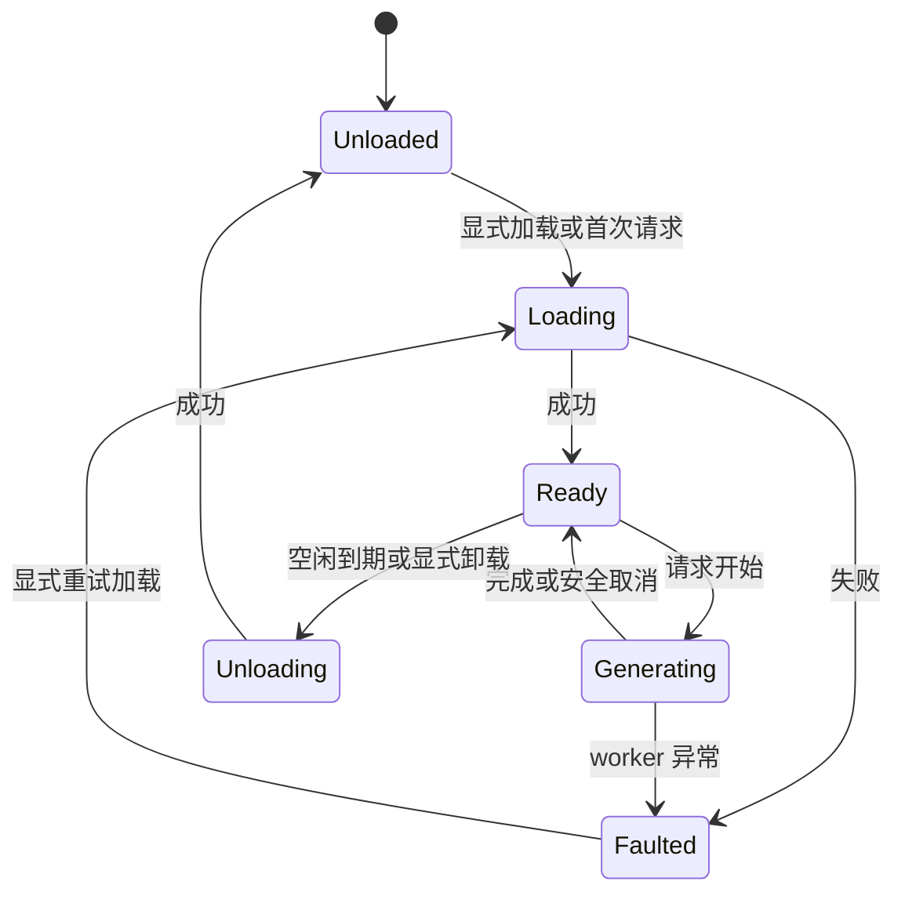

# Nexa Runtime v0.1 开发执行文档

- 版本：2.1（Windows 开放模型开发契约）
- 日期：2026-10-03
- 项目名：Nexa；命令与原生符号沿用 `ai-runtime` / `ai-runtime-worker` / `air_*`
- 文档对象：实现项目的开发者、编码 AI、验收人员

> 本文定义Windows runtime契约与后续验收，不代表所有规划已经实现。ADR0015开放模型字段/行为已由50c9d41 WindowsCI固定GGUF回归并发送，用户目标机待验；ADR0016混合目录与诊断源码已冻结、本机合成回归/独立审查通过，WindowsCI/整包及交付仍待完成。35bfd85/389eeef不能追溯获得新行为。实现/真实模型/CI/目标设备结果见当前状态；旧混合平台v1.3保留于历史快照，不再作为当前要求。

> 2026-10-04：局域网推理增量按 [ADR0020](docs/decisions/0020-opt-in-lan-inference-api.md)，默认关闭、独立凭据/监听，只服务本机已加载模型；下面原回环约束仍完整适用于本机管理。实施与验收见当前状态。

> 2026-10-04 模型登记行为按 [ADR0021](docs/decisions/0021-selected-file-model-registration.md)：添加仅核验选中文件、无复制，默认不自动全库扫描；下载目录配置与明确扫描分离，schema2兼容读取旧登记。实施/验收见当前状态。

本文负责runtime具体契约；[架构](docs/architecture.md)负责职责，[ADR0014](docs/decisions/0014-windows-desktop-cpu-runtime.md)负责范围，[路线](docs/roadmap.md)负责W00–W05依赖，[当前状态](PROJECT_STATE.md)记录事实。deepseek harness接入新增门槛见[harness契约](docs/windows-harness-contract.md)。

## 1. 目标与冻结决策

构建面向 Windows 桌面 CPU 的本地 LLM runtime，以固定 llama.cpp 为推理核心，让其他应用通过本机 API 调用。Rust保留模型、调度、取消/超时、生命周期、HTTP/CLI与安全边界；桌面界面管理模型与服务，聊天辅助验证。Windows10 x64 / i5-8400 / 16GB内存优先，后续以真实设备证据扩大Intel/AMD桌面CPU与Windows11。

| 项目 | 当前决定 |
| --- | --- |
| 推理引擎 | 固定llama.cpp + 自有C++ shim；不把Rust封装当成新计算内核 |
| 模型 | 合规单文件GGUF开放候选尝试，不按型号/hash白名单；精确矩阵仅记录已测证据，结构/完整性/模板/资源仍检查 |
| 运行形态 | Rust管理进程 + 按需独立CPU worker；父端不链接原生库 |
| UI | Tauri 2 + React/TypeScript/Vite；管理器增量见W03 |
| HTTP | Axum + Tokio，默认`127.0.0.1:18080`，回环/Bearer/Host/Origin边界保持 |
| 现有外部接口 | `/v1/models`、`/v1/chat/completions`严格文本子集及`/runtime/*` |
| 接入目标 | 官方dsh的pi-ai自定义openai-completions provider；兼容增量尚待实施/验证 |
| 并发与历史 | 1个模型、1个运行槽、有限FIFO；调用方提交完整messages并保存业务历史 |
| KV cache | 每请求独立，当前不跨请求复用 |
| 模型目录 | managed受控复制导入 + external只读零复制登记；不内置市场 |

### 1.1 交付顺序

W00后，W01当前包短验与W04最小harness文本互通并行推进；真实工具闭环依赖W02实用模型/工具能力准入，W04文本不被W03托盘阻塞。各阶段门槛通过后进行W05后期发行验收。W阶段定义见路线；T00–T06是已有建设/验证背景，不重复开发。

目标硬件不等于已支持。当前Server2022 CI与旧Windows10短验分层，Windows11和新Intel/AMD CPU独立验收。无开发工具、实际离线和长期稳定性仍按用户要求放在后期，不阻塞当前开发，也不提前写成通过。

### 1.2 非当前目标

Android/MNN/Flutter、其他操作系统、GPU/NPU、完整聊天产品、账号/云同步、模型市场、公开网络服务和Telegram业务均不作为当前产品依赖。历史代码、隔离CI和未提交研究工作保留，不删除或覆盖。

首阶段不增加多模型并行、连续批处理、跨会话KV复用、分布式推理、embedding/RAG或动态插件ABI。harness需要的工具消息协议单独设计和验收；工具执行由调用方拥有，runtime不成为自主操作工具的Agent。

不预设固定包体、内存或tokens/s；按模型/参数/目标设备实测。文本协议兼容、模型文本质量和模型工具能力分别准入。

## 2. 架构与职责

```text
其他本机应用 / dsh / 桌面bridge
→ API管理进程(runtime-core + model-store + process-host)
→ 私有IPC → worker → engine-host专用线程
→ llama-adapter / C++ shim / llama.cpp
```

| 模块 | 负责 | 不负责 |
| --- | --- | --- |
| runtime-types | 请求、事件、错误、配置与协议版本 | UI/HTTP/原生指针 |
| runtime-core | 单actor、队列、取消、状态、deadline、空闲卸载 | tokenizer、计算内核、业务会话 |
| model-store | managed/external GGUF、manifest、加载资格/完整性 | 市场下载、业务数据库 |
| process-host / runtime-ipc | 父端执行器、回收、私有协议与信用 | 父进程链接原生库 |
| engine-host / llama-adapter / shim | 专用线程、模板/tokenizer/采样/推理/释放 | HTTP或UI |
| runtime-api / runtime-cli | 鉴权、HTTP/SSE、管理、发现/关停 | 直接操作模型指针 |
| runtime-worker | IPC控制、原生线程、故障隔离 | 公开端口或第二调度器 |
| desktop-bridge / UI | 模型/服务管理、验证聊天与状态 | 自建推理队列、把token交给WebView |

保留有实际Windows作用的Executor/ModelResolver边界，不为移动复用继续加抽象，不重写已验证调度为上游server转发。

### 2.1 PC 进程

1. `ai-runtime serve` 启动 API、model-store 和调度器，不立即加载模型。
2. 加载时启动唯一 `ai-runtime-worker`；worker 包含 llama.cpp 原生依赖。
3. 父子进程使用私有 stdin/stdout 管道；日志只写 stderr。
4. API 进程不链接 llama.cpp，worker 崩溃不会直接带走 API 进程。
5. 空闲卸载完成后退出 worker；下一次请求按需重新创建。
6. API 退出时回收 worker；worker 发现父管道关闭后自行退出。Windows 打包时使用 Job Object 等平台机制防止遗留进程。

worker 崩溃属于模型运行失败，不自动重放已经输出一部分的请求。正在执行和排队的请求全部失败，状态转为 Faulted；用户显式 load 或重启服务后才能恢复。避免后台反复崩溃重启。

## 3. 工程目录与依赖边界

以下路径从项目根目录算起；实际已存在入口见项目索引，不为规划预建空目录。

| 路径 | 内容 |
|---|---|
| `Cargo.toml`、`Cargo.lock` | Rust workspace 与锁文件 |
| `rust-toolchain.toml` | 精确 Rust 工具链版本 |
| `crates/runtime-types/` | 类型、事件、错误和序列化 |
| `crates/runtime-core/` | 调度器、生命周期、资源策略 |
| `crates/model-store/` | GGUF managed/external存储、独立loadable与历史validated |
| `crates/engine-host/` | 已有 PC llama 原生线程执行器 |
| `crates/process-host/`、`crates/runtime-ipc/` | PC父进程执行器、私有NDJSON与信用校验 |
| `crates/llama-adapter/` | Rust 安全封装及 native 构建入口 |
| `crates/runtime-api/` | Axum 路由、鉴权、SSE |
| `crates/runtime-worker/` | `ai-runtime-worker` 二进制 |
| `crates/runtime-cli/` | `ai-runtime` 二进制 |
| `native/llama-shim/` | 自有 C ABI 头文件、C++ 适配、CMake |
| `vendor/llama.cpp/` | 固定 commit 的 Git submodule |
| `apps/desktop/` | Tauri + React 应用及前端锁文件 |
| `xtask/` | 构建、打包、验收命令 |
| 各crate的`tests/` | 已有HTTP/SSE/IPC/错误契约测试；不将规划中的`tests/contract/`当现有入口 |
| `tests/fixtures/` | 小型输入文本、畸形文件；不提交大型模型 |
| `docs/build-lock.md` | 工具版本、对应引擎commit、按资产路径记录的转换来源、构建选项、设备信息 |
| `docs/model-matrix.md` | 模型文件/包 hash、模板、变体/后端与验证结果 |
| `docs/decisions/` | 需要改变本规格的技术决策记录 |
| `artifacts/verification/` | 测试与性能报告，不提交聊天正文 |

依赖方向：types 被其他模块引用；core 仅依赖类型、存储接口和执行器接口；API、CLI、worker作为组装入口。llama原生类型不能泄漏到core。

技术依赖冻结：Tokio、Axum、Serde、thiserror、tracing、Clap、SHA-256 实现、平台数据目录库。只按实际用途引入依赖，不预先加入数据库、gRPC、WebSocket、插件系统。

## 4. 原生集成规格

本节描述Windows llama路径；已有契约保持，新增模型能力按精确版本另行验收。

### 4.1 选择库集成

Windows 产品使用 llama.cpp 库和自有轻量 C++ 适配层。上游工具可用于行为对照，不与自有API形成两套生产实现；当前CMake关闭LLAMA_BUILD_SERVER。

llama.cpp 提供 C API；复杂聊天模板还需要关注同版本的 common/chat 辅助实现。不能把所有模型的 messages 简单拼成一段字符串。第一版在 C++ shim 内使用锁定版本的模板辅助代码，封装其 C++ 依赖。[S3][S4]

### 4.2 C ABI 边界

下面是本项目接口名称与语义约定，不是上游已有函数签名。T01 要把它们落实成 `native/llama-shim/include/air_llama.h`。

| 操作 | 语义 |
|---|---|
| `air_engine_create/destroy` | 初始化/释放当前进程的引擎资源 |
| `air_model_load/unload` | 加载 GGUF、模板与上下文；释放时遵守依赖顺序 |
| `air_prepare` | 应用模板、分词、计算准确 prompt token 数；返回不透明 prepared handle |
| `air_prepared_free` | 未执行或被取消时释放 prepared handle |
| `air_generate` | 消费 prepared handle，以回调返回生成事件 |
| `air_cancel_create/set/destroy` | 创建、设置、释放独立取消标志 |
| `air_buffer_free` | 释放由 shim 分配并返回的缓冲区 |
| `air_get_build_info` | commit、编译后端、shim 协议版本 |

约束：

- ABI 使用固定宽度整数、不透明句柄、`pointer + length`；不跨边界传 `std::string`、Rust `String` 或 STL 对象。
- fallible 操作返回固定宽度状态码（0 表示成功）和显式 error 输出；失败输出不携带可用句柄。错误文本按同一缓冲区释放规则处理，不依赖跨线程的全局 last_error。
- 明确每个缓冲区由谁分配、谁释放；跨边界字符串为 UTF-8，Windows 文件打开需正确转换原生路径。
- 回调期间数据只借用；Rust 必须在回调返回前复制需要保留的内容。
- C++ 异常在 shim 捕获并转错误；Rust 回调不得 panic 穿越 C ABI。
- engine、model、context、sampler 全部在同一推理线程创建和释放；禁止为方便编译盲目添加 `unsafe impl Send/Sync`。
- 只有取消标志允许并发访问，它的存活时间覆盖整个 load/generate 调用。取消通道不排在正在执行的生成任务后面。
- 释放顺序：prepared / sampler → context → model → 引擎。所有失败路径也执行清理。

### 4.3 一次推理的固定流程

1. Rust 检查请求结构、长度、参数和当前模型。
2. 请求获得运行槽位后，shim 按模型模板格式化完整 messages。
3. 按模型 tokenizer 规则处理 special token、BOS/EOS；不重复加入。
4. `air_prepare` 计算 prompt token 数并检查上下文预算；失败时尚未开始 SSE 正文。
5. 清空该次请求之前的 KV 与采样状态，创建本次 sampler。
6. 分批 prefill，每批之间检查取消、截止时间与输出消费者状态。
7. 逐步 decode，按 sampler 采样，判断终止 token、用户 stop 和输出预算。
8. 增量重组 UTF-8，处理跨 token 的 stop 字符串，再向上层发布文本增量。
9. 输出一个终态事件和实际 token 统计，销毁 sampler/prepared，清理请求 KV。

上下文预算规则：`prompt_tokens + max_tokens <= context_size`。prompt_tokens 必须包含模板和特殊 token。第一版不静默截断历史，不自动摘要，也不开启上下文滑动。

### 4.4 开放模型与历史验证（ADR0015，用户目标机待验）

用户要求16GB目标机支持很多模型，不将运行范围固化为特定几个型号。候选加载不依赖模型名、文件名、架构名列表或预先批准的hash；锁定llama.cpp实际loader判断架构、张量与执行能力。精确[模型矩阵](docs/model-matrix.md)仍记录已测输入/设备/参数，不能把未列入表等同禁止尝试。

`validated`、`validation`和已有capabilities继续表示精确历史证据；伪造证据或不一致manifest必须拒绝。独立`loadable`表示manifest满足受控候选条件，不证明当前文件完整性；实际提交native前仍须store准备成功，`available`结合已观察到的文件/目录失败；二者都不是成功加载、质量或内存保证。登记时的hash/metadata也不能代替实际load前完整性复验。

当前开放切片的结构边界为GGUF v2/v3、单文件、已实现tensor布局和有界metadata。常规/K等已实现布局可检查，未知layout不放行；split.count>1或split.no!=0拒绝，防止引擎打开未纳入hash/lease保护的邻接文件。加载后拒绝encoder、diffusion、noncausal或不具备所需decoder的执行方式。文件名、GGUF magic或metadata架构名称不能替代这些检查。

### 4.5 原始模板与文本能力边界

必须使用GGUF内非空原始Jinja模板及其vocab。直接应用时关闭可用的thinking选项，但不要求每个模板都声明该开关，也不因原模板不包含此开关便按型号拒绝。禁止fallback模板、system/role合并改写、静默丢内容或通用正则剥离思考/控制标签。

当前单轮/多轮与实际每个请求检查文本continuation：带generation prompt的前缀必须与追加assistant探针后的前缀一致；末尾符合原vocab EOG与允许空白规则，vocab自动EOS特例单独检查。system不受支持时明确报错，不静默塞入user。需要额外输出framing、工具/思考解析或遇到非EOG控制token的情况明确失败，不把这些输出拼成正常完成。

该窄文本契约不等于支持全部Jinja、全部模型或可靠关闭任意模型的思考模式。缺失/不支持模板返回unsupported_chat_template；实际架构/执行方式不支持返回受控模型错误，普通加载/资源失败如实区分，不伪装成未通过hash许可。

开放文本加载不授予工具能力、结构化输出或完整harness兼容性。1.7B/4B等只是CPU内存/质量基准样本，不是产品清单。工具wire/模型能力/实际agent回合见独立[工具契约草案](docs/windows-tools-contract.md)，尚未实现；任何实测标签必须保留精确资产、模板、引擎、参数和设备证据。

原始模板、metadata key与tensor name含NUL时拒绝，避免Rust/native的C-string身份截断；普通tokenizer metadata values含NUL不一概禁止。Engine初始化强制关闭common/Jinja日志并使用受控静态模板错误，最终隐私canary只证明被覆盖的成功/异常路径，不作绝对无泄漏承诺。

## 5. 模型、配置与资源

### 5.1 数据目录

Windows使用用户数据目录，支持`--data-dir`显式覆盖；同一实例的所有客户端必须使用相同目录。

以下是既有managed GGUF布局；external行为见[目录契约](docs/t06-model-directory-contract.md)。

| 相对路径 | 用途 |
|---|---|
| `config.toml` | runtime 配置 |
| `secrets/api-token` | PC 本地 API 令牌，只允许当前用户读取 |
| `models/<model_id>/model.gguf` | 管理后的模型文件 |
| `models/<model_id>/manifest.json` | 模型元信息与校验结果 |
| `imports/<import_id>.partial` | 导入中的临时文件 |
| `logs/` | 轮换日志 |
| `runtime/` | 实例锁和运行时发现信息 |

`model_id` 限制为 `[a-z0-9][a-z0-9._-]{0,63}`。HTTP 模型字段只接收已注册 ID，不接收文件路径。

导入顺序：检查空间和来源可读 → 复制到临时文件并计算 SHA-256 → 检查 GGUF / manifest → 在同文件系统原子移动 → 更新索引。失败清理 `.partial`。默认不覆盖同名模型；删除注册项不删除用户原始文件。

现有 Windows GGUF manifest 至少包含：schema_version、id、display_name、relative_file、size_bytes、sha256、source、architecture、quantization、template_sha256、context_limit、default_context、validated_llama_commit、capabilities。未知字段可保留；缺失关键校验字段不标记为已验证；无历史validated不等于不能成为受控加载候选。T02目录原子提交、Windows保留文件名限制和验证缓存决策见 [ADR0003](docs/decisions/0003-t02-scheduler-storage-and-observability.md)，不改变公共model_id语法。

managed导入前、manifest与load统一单文件≤16GiB；external原16GiB限额保持。该文件读取/登记预算不是16GB RAM成功保证。已交付50c9d41在metadata context小于默认2048时默认扫描登记仍失败。本轮ADR0016仅自动扫描改取min(2048,metadata)，显式import/load和UI设置不静默夹紧；增量已过本机合成回归/独立审查，WindowsCI与目标机另验。

外部目录应用/重扫按[ADR0016](docs/decisions/0016-mixed-model-directory-diagnostics.md)：完整有界扫描后一次原子发布合法集合；好坏混合为partial并返回完整内容拒绝诊断，全坏failed/model_scan_no_usable_files保旧目录/index/generation，无GGUF候选可空提交。坏文件计全部候选/字节预算，GGUF parser的header/string/metadata/tensor等限额，以及I/O、路径/reparse、身份、取消/timeout/save均硬失败。私有read_for_scan只为扫描将typed预算映射既有ModelLibraryLimit，不改变managed读取语义。

scan-only在同一DirectoryGuard核旧目录身份，apply可由显式selection换新目录；成功与软拒source guard保持到提交或放弃决定，已确定不可发布的硬失败退出后可释放。私有DTO增加partial/file_errors/rejected_files，旧completed缺字段按[]/0；完整diagnostics≤512KiB、operation≤1MiB，诊断只在当前App生命周期内保存。terminal在工作/实例锁释放后发布。公共HTTP、worker/native/library schema及包内preflight均不改；详见[目录契约](docs/t06-model-directory-contract.md)，本轮结果另行登记。

### 5.2 默认配置

此配置是产品默认值，后续性能测试可以通过决策记录调整。

```toml
schema_version = 1

[api]
listen = "127.0.0.1:18080"
max_body_bytes = 1048576
token_file = "secrets/api-token"

[runtime]
max_active_models = 1
max_running_jobs = 1
max_queued_jobs = 8
queue_timeout_seconds = 120
execution_timeout_seconds = 300
load_timeout_seconds = 300
idle_unload_enabled = true
idle_unload_seconds = 300
model_verification_timeout_seconds = 300
cancel_grace_seconds = 5

[inference]
backend = "cpu"
context_size = 4096
max_output_tokens = 512
temperature = 0.7
top_p = 0.9
gpu_layers = 0
```

当前API默认context4096/batch512、线程min(4,可用逻辑CPU)，桌面验证档2048/2线程/128；历史仅证实各自测过的组合。开放候选上限为模型metadata与131072既有硬限中的较小值，实际loader可进一步拒绝；这不是16GB可运行该窗口的保证。调整默认须实测，不静默降级。execution_timeout 包含 prepare/prefill/decode，不包含排队和模型加载；三类计时分别记录。

`backend`、`context_size` 是 load-time 参数；修改后需要卸载并重新加载。当前构建仅接受backend=cpu和gpu_layers=0；保留字段不等于提供GPU支持。`max_output_tokens` 是请求未提供输出预算时的默认值，不是无条件可用的剩余上下文。

按[ADR0023](docs/decisions/0023-model-verification-and-idle-policy.md)，文件校验超时范围30..7200秒，整次校验共用预算，不改变下载传输、原生加载或短文本计时；缺省300秒。`idle_unload_enabled=false`明确关闭空闲卸载，保留等待秒数（桌面新保存1..86400秒，旧手工长TTL读取保持兼容），显式卸载/切换/关停继续有效。旧配置缺少字段按true/300秒读取；新字段不保证旧版程序可读。运行策略须停服持锁保存，新操作/下次启动生效。

### 5.3 CPU设备与资源

当前仅CPU，显式请求其他backend或gpu_layers非零必须拒绝，不假装回退成功。status/devices区分配置与实际观察；未知指标保持null/unavailable。构建关闭GGML_NATIVE但仍有实际指令集要求，见[构建锁](docs/build-lock.md)，不能宣称任意x64兼容。

Windows10/i5-8400为首测目标，其他Intel/AMD桌面CPU按实际硬件扩展；线程、batch、context推荐须测量，不按品牌或核心数直接推导最优值。

内存成本包含权重、KV、计算缓冲、API/worker/UI及其他程序。用户16GB总内存不等于可用量，当前Job没有RAM硬限制；进程隔离不是完整OOM或系统响应性保障。资源不足应明确失败/提示减小context或模型，不偷偷换量化、模型或删历史。资源预测与硬限制均不得写成已实现。

每次实际加载（含idle重载和显式恢复Unload后）须重新resolve并检查ID、loadable、文件指纹/metadata与context限制，历史validated不能代替当前完整性；选中缓存不是永久授权。变化时拒绝native Load，保留模型ID和原参数，完整校验仍在actor外进行。

空闲计时只在无活动任务、无排队任务时启动。计时器触发与新请求到达由调度器串行决定，禁止卸载正在推理的 context。

## 6. 调度、状态与取消

### 6.1 模型状态



队列独立于模型状态存储。一个调度器 actor 负责所有状态转换，不使用多个互相竞争的全局互斥锁控制加载与卸载。

- selected_model 初始为空；首次有效请求可选择已注册模型并触发加载。
- selected_model 已确定后，其他模型请求返回 409 `model_conflict`，不自动挤出当前模型。
- 空闲卸载保留 selected_model 与加载参数；下一次同模型请求可重新加载。
- 显式 load 可以在没有运行或排队任务时更换模型；有任务时返回 409 `runtime_busy`。
- 同模型、同参数重复 load 为幂等操作；显式 unload 同样要求任务全部结束。
- 重启 runtime 后 selected_model 为空；不恢复旧任务。
- 加载失败使当前批次任务失败；不能让后续请求无限等待。Faulted 只接受查询、关停或显式 load 重试。

进程回收未获OS确认是窄化的fail-closed例外：父端专用CleanupUnconfirmed事件使状态保持Faulted、last_error为executor_cleanup_unconfirmed，当前及排队请求均Failed（即使先前已请求取消）。此执行器不可再显式Load恢复，不允许创建第二个child；shutdown必须有界返回清理错误，不能冒充reaped或安全ACK。状态查询仍可用，诊断保留未确认PID；该事件/错误码不允许worker通过wire声明。它不改变普通已确认死亡后的显式Load恢复规则。

### 6.2 请求状态与事件

请求状态：`Queued → Preparing → Running → Completed / Cancelled / Failed`。Preparing 可以包含按需加载、模板格式化和分词。

公共事件至少包括：Accepted、Queued、Loading、Started、TextDelta、Completed、Cancelled、Failed。每个事件带 `request_id`、单调递增的 `seq`；每个请求只能有一个终态。Started 表示模型已准备好、token 预算通过，此时才可开始正常 SSE 响应。

这些事件是core内部公共语义；HTTP 按第 7 节映射，Started 前不提供正常 SSE。当前 status 只有聚合状态和活动 ID，不承诺全量排队事件或断线重放；更细的请求观察仅在当前调用方实际需要时另行设计。

请求 ID 使用 UUID。调用方可提供 `X-Request-ID`，服务校验格式并拒绝当前仍存在的重复 ID；未提供则生成。ID 同时出现在 HTTP 响应头、日志、状态事件中。UI 自行生成 ID，以便响应头尚未返回时也能取消。

等待队列 FIFO，容量不包含当前运行槽。PC 最多 1 个活动请求 + 8 个等待请求。请求体先受大小限制再入队；记录进入队列的时间，超过 queue_timeout 即失败。

首个请求预留活动槽后加载模型，同模型后续请求排队。取消最后一个需求方时应尽力终止加载；某个等待方取消不能打断其他任务需要的加载。

### 6.3 取消与背压

取消来源：UI 停止按钮、HTTP 客户端断开、显式取消接口、超时、消费者停止读取。

1. 取消等待任务：移出队列并发布 Cancelled，不加载模型。
2. 取消运行任务：控制通道立即设置原子标志；推理循环在 prefill 批次间和 decode 步骤间检查。
3. 原生 abort 回调仅在锁定后端确实支持时使用；不能承诺任何 GPU 内核都能立即中断。官方当前 C 头文件对相关回调标有 CPU 执行限制。[S3]
4. PC 超过 5 秒仍未结束时，父进程终止 worker，当前请求为 Cancelled，其余请求因 worker 重置失败，进入 Faulted；必须显式重新 load。
5. 不释放仍被执行的原生资源。UI显示“正在停止”直到安全返回或整个worker经OS确认回收；无法确认清理时返回错误，不宣称取消完成。

终态归因：普通取消意图（request_cancelled、consumer_stopped、slow_consumer、runtime_shutdown）不能覆盖执行器随后报告的真实非控制错误，GenerationFailed与Faulted均保留该失败。执行器对取消/队列、加载、执行超时的控制确认仍按原取消或deadline语义处理，PC已回收强杀不因此改为原生故障；既有deadline/协议失败原因优先级不变。CleanupUnconfirmed仍最高优先级，断流不强制补发事件，已经发布的终态不重写。

shutdown始终等待安全边界并调用close。关闭进行中新发生且未被控制原因归类的故障须保留，即使相应加载请求已经Cancelled；返回优先级为清理未确认、close自身错误、本次关闭的新真实错误、成功。关闭前已处理或恢复的历史last_error不自动污染后续shutdown。返回真实错误不自动证明清理未确认；调用方须结合具体执行器契约判断，不能把任意close错误假称资源已回收。

事件缓冲有界：每请求最多 256 KiB 待发送文本，单个 delta 最多 4 KiB，按 UTF-8 字符边界切分。缓冲超过上限且 10 秒没有消费进展，取消为 `slow_consumer`。不能为了发布终态继续无限等待一个已经阻塞的消费者。T02以一个共享预算计入执行器、actor和消费队列的全部在途文本；短delta可保守计费以同时约束事件开销。原生同步回调只允许在decode步骤之间有界、可取消等待；活动槽仍保留到原生调用安全返回。

一般设备上的交互目标：UI 立即响应停止操作，CPU 小模型取消通常应在 1 秒内完成；这是验收目标，必须记录实测。取消目标必须由目标CPU实测，不能借CI样本作普遍保证。

### 6.4 PC IPC

使用逐行 JSON（NDJSON），每帧一行，字符串内换行由 JSON 转义。共享实现位于 runtime-ipc，父端 process-host 不链接原生库；runtime-worker 直接使用 EngineHost，不创建第二个 Runtime。父端仍是公共状态、FIFO、deadline 与 request seq 的唯一来源。

- 每帧带 protocol_version、session_id（每次spawn的新UUID）、operation_id、request_id、kind、payload及seq。Hello和命令的seq为null；worker事件seq从1开始，在同session内严格递增，不重置为公共seq
- 请求帧上限2 MiB，事件帧上限64 KiB，均包含最后LF。完整编码必须在首次写出前检查；读取在累积前检查上限，拒绝残缺EOF、非法UTF-8、未知字段/kind、重复字段、版本或身份不符
- 父端先发送Hello并指定session；worker读取实际build_info，35bfd85基线双方严格核对protocol=1、shim=2、llama commit=`2149c00f4442dc59302e134a02e4c99d5f7ed9fc`。Hello的operation_id=0、request_id=null；握手前不能执行操作
- 命令为Load、Generate、Unload、Cancel、Credit、Shutdown。普通操作operation_id非零递增，Generate的request_id须与payload相同；Cancel/Credit只作用于绑定的session/operation/request。Shutdown为session控制帧，operation_id=0、request_id=null
- 事件为原始ExecutorEvent，包括Prepared、TextDelta和清理后的终态；Loaded/Unloaded对应各自操作。Prepared只能一次，TextDelta/Completed不能抢在它前面，usage须匹配Prepared及请求max_tokens；每操作仅一次终态
- 父端是唯一输出预算账本。每Generate预留16 KiB暂存和最多两个120 KiB信用，合计≤256 KiB。信用ID在session内非零严格递增，每个信用只准一次≤4 KiB UTF-8 delta，其完整编码≤25 KiB（最坏24 KiB转义正文+1 KiB封套）
- 信用不会在worker写出或父端读取时自动归还。不可复制的TextPermit贯穿IPC→actor→EventLease；消费写入完成/丢弃后才释放。关闭、旧代际、失败或未用信用仅释放自己持有的permit，不把共享总账本清零
- 最近已结束操作可接收在终态传播竞态中刚发出的新Credit并立即退休；迟到Cancel幂等，均不得转用于下一操作。重复/倒退信用、跨session或其他旧operation仍是协议错误
- 两信用是保守内存取舍，不是吞吐保证。256 KiB只表示callback之后合规待发送输出的保守账本；输入帧、畸形帧解析有独立硬限，模型、KV、原生tokenizer/stop暂存、分配器与线程栈另计，不能宣传整个堆≤256 KiB
- worker读取控制线程独立于推理和stdout写线程。Cancel立即设置独立标志并唤醒信用等待；stdout阻塞不得堵住读取取消。stdout只用于协议，原生日志写stderr
- 首次取消开始五秒宽限，重复取消不重置期限。未获安全清理ACK时终止并回收整个worker，确认死亡后才报告Faulted；正常终态在资源清理后发送，槽位一直保留到ACK/已回收故障
- EOF、破损帧、异常退出、握手或退出超时使受影响请求内部各终结一次；不重放任何部分输出。Faulted后只由显式Load启动新worker；旧worker已回收时显式Load恢复链内部的ExecutorCommand::Unload可直接确认；Faulted下公共unload仍返回RuntimeFaulted。Runtime shutdown还等待Executor::close完成并报告回收错误

W02内部ResolvedModel由validated改为独立loadable，私有IPC现为2，shim行为身份为3，公共协议仍1，C ABI布局保持v2。adapter Engine::new核对实际build_info，旧AIR_NATIVE_DIR archive、旧父/worker混搭和伪造identity均拒绝；worker Hello及包manifest/独立验收器同步。此tuple已在50c9d41 WindowsCI回归并随包发送，用户目标机待验；本轮目录增量不改该tuple；其他信用、终态及取消门槛不降低。

Windows进程containment、各阶段超时与验证范围见 [T03决策](docs/decisions/0004-t03-process-isolation-and-credit-ledger.md) 及 [T03验证](docs/verification/2026-10-01-t03-worker.md)，不把Linux开发探针当作Windows目标验收。

## 7. HTTP 与客户端契约

### 7.1 兼容边界

本产品只声明下表中的 Chat Completions 文本兼容子集。上游自己的 server 也未保证完整 OpenAI API 兼容，因此不能把“提供同名路由”等同于所有第三方软件无修改接入。[S6]

| 路由 | 行为 |
|---|---|
| `GET /healthz` | 无鉴权，仅返回 API 进程是否存活；不暴露模型/路径 |
| `GET /v1/models` | 可供使用的模型，标准 list/data 结构；有界 limit/after 分页 |
| `GET /runtime/models` | 鉴权安全管理摘要，包含未验证模型；有界 limit/after 分页 |
| `POST /v1/chat/completions` | 文本 messages，流式或非流式 |
| `GET /runtime/status` | 模型状态、队列数、活动 ID、后端、错误与内存指标 |
| `GET /runtime/devices` | 本构建后端与设备探测结果 |
| `POST /runtime/models/import` | 当前用户本地文件导入；只供受信任本机管理客户端 |
| `POST /runtime/load` | 显式加载/切换，完成后返回 200；受 load_timeout 约束 |
| `POST /runtime/unload` | 无任务时卸载，返回最终状态 |
| `POST /runtime/requests/{id}/cancel` | 标记取消；存在活动请求返回 202，未知 ID 返回 404 |
| `POST /runtime/shutdown` | 停止接收新请求、取消任务、回收 worker、退出 |

T04 增补：两种 models 列表均支持 limit（默认64、1–128）和 after ModelId，ID升序；next_after 为下一页 ModelId，末页null。管理摘要不包含完整manifest/source/path/extra，chat/load仍只接受注册ID。35bfd85基线`/v1/models`仅列旧准入模型；ADR0015增量改按当前available/loadable筛选，未有历史validated的合法候选也可列出，列表不承诺实际load必成功；现有注册表无可靠创建时间，省略created，不虚构0。客户端应遍历分页，此为首版兼容边界。

所有 `/v1/*` 和 `/runtime/*` 使用 `Authorization: Bearer <token>`。本机管理监听只接受回环连接，不提供 `0.0.0.0` 监听开关；用户显式启用的独立LAN推理监听遵循ADR0020，不放宽本段管理接口约束。令牌由 init 生成，日志不得输出，读取权限限当前用户。

healthz可选HMAC-SHA256 challenge/proof headers用于CLI在发送Bearer前认证服务端；MAC绑定版本域、实际instance UUID、随机32字节nonce及accept socket实际client/server端点，CLI必须在同一固定HTTP/1连接恒时验证，不能依赖公开nonce、重连或重定向。health正文仍仅表存活。详见[T04决策](docs/decisions/0005-t04-loopback-http-and-management.md)。

HTTP 默认不启用浏览器跨域访问；有 Origin 的请求只允许明确配置的可信来源，并验证 Host。桌面 UI 通过 Tauri Rust 命令代理调用本机 API，令牌不进入前端脚本。不要用允许任意 origin 的 CORS 设置解决 UI 接入问题。

### 7.1.1 deepseek harness增量（W04规划，未实现）

当前7.2及既有SSE仍是严格文本契约。工具定义、assistant.tool_calls、role:tool/null content、tool delta与finish_reason=tool_calls尚未由本次文档实现。新增字段须贯穿DTO/core/IPC/shim/模板/事件，并保持预算、终态、取消和安全边界；工具执行仍归调用方。

接入使用dsh-llm-pi-ai自定义openai-completions provider，不先实现Messages。compat开关、真实请求fixture、工具/usage/错误/Stop/重试及H01–H12以[harness契约](docs/windows-harness-contract.md)为准。当前接口明确拒绝未支持字段，不能静默忽略来冒充兼容。

### 7.2 Chat 请求字段

| 字段 | 第一版规则 |
|---|---|
| `model` | 必填，已注册 ID |
| `messages` | 必填，1–128 条；role 为 system/user/assistant；content 为字符串 |
| 消息顺序 | 至多一个 system 且在首位；随后 user/assistant 交替；最后为 user |
| `stream` | 默认 false |
| `max_tokens` | 1–4096，默认由配置给出；仍受模型上下文余额约束 |
| `max_completion_tokens` | max_tokens 的别名；两者同时出现则返回 400 |
| `temperature` | 0–2，默认 0.7；0 使用 greedy 路径 |
| `top_p` | 大于 0 且不大于 1，默认 0.9 |
| `seed` | 可选，非负 32 位整数；只承诺同环境尽力复现 |
| `stop` | 可选，字符串或最多 4 个非空字符串；每个最多 128 个 UTF-8 字节 |
| `n` | 仅允许省略或 1 |
| `stream_options.include_usage` | 允许；只对 stream=true 有效 |
| `user` | 可接收的标识，长度限制 128 字符；不写入默认日志，不参与调度 |

不支持的已知功能字段（如 tools、tool_choice、response_format、logprobs、非零 penalties、多模态 content）返回 400 `unsupported_parameter`，不得静默忽略。frequency_penalty/presence_penalty=0、logprobs=false、tool_choice="none" 可作为兼容空操作接受。其他未知字段返回 400，并指明字段名。

当前已实现文本接口没有developer/tool角色、Responses API、会话恢复或服务端聊天历史。W04工具协议另行实施；文本smoke关闭工具并单独记录兼容结果，不把规划说成现版本行为。

内部air_prepare不是已经发布的计数API。调用方如需单独预算查询，应按实际需求记录ADR并同步Windows接口；可选摘要业务不驱动本版公共协议。

### 7.3 请求与非流式响应示例

```json
{
  "model": "qa-small",
  "messages": [{"role": "user", "content": "用一句话介绍本地 AI。"}],
  "max_tokens": 128,
  "temperature": 0.7,
  "stream": false
}
```

```json
{
  "id": "chatcmpl-7d0d3c16-9280-4f48-b50e-b26136ad4990",
  "object": "chat.completion",
  "created": 1790640000,
  "model": "qa-small",
  "choices": [{
    "index": 0,
    "message": {"role": "assistant", "content": "本地 AI 在你的设备上运行模型。"},
    "finish_reason": "stop"
  }],
  "usage": {"prompt_tokens": 20, "completion_tokens": 15, "total_tokens": 35}
}
```

非流式完整JSON（含转义和封套）上限96KiB，使用同一输出预算的紧凑permit转移；超限取消并返回400 `invalid_request_error` / `response_too_large` / param=`stream`，建议流式或减小输出，不截断、落盘或重放。

示例时间戳、token 数和回复仅示范格式；实现必须使用实际统计。prompt_tokens 包括模板 token；completion_tokens 包括生成过程中采样的终止/stop token，文本字符数不能代替 token 数。

### 7.4 SSE

HTTP 设置 `Content-Type: text/event-stream`、禁用响应缓冲；每条数据以空行结束。所有 chunk 的 id、created、model 保持一致。

```text
data: {"id":"chatcmpl-example","object":"chat.completion.chunk","created":1790640000,"model":"qa-small","choices":[{"index":0,"delta":{"role":"assistant"},"finish_reason":null}]}

data: {"id":"chatcmpl-example","object":"chat.completion.chunk","created":1790640000,"model":"qa-small","choices":[{"index":0,"delta":{"content":"你好"},"finish_reason":null}]}

data: {"id":"chatcmpl-example","object":"chat.completion.chunk","created":1790640000,"model":"qa-small","choices":[{"index":0,"delta":{},"finish_reason":"stop"}]}

data: [DONE]

```

正常结束 reason 为 stop 或 length。请求 include_usage=true 时，在 finish chunk 与 [DONE] 之间发送 choices=[] 的 usage chunk；统计字段与非流式一致。

发出 SSE 响应前完成排队、加载、模板和上下文预算检查，错误可使用对应 HTTP 状态。等待期间客户端 read timeout 应覆盖排队、加载和首 token 处理，不以服务暂未返回正文判定卡死。

SSE 已开始后出错，发送一个 `data: {"error":{...}}` 事件后关闭连接，不发送成功 finish 或 [DONE]。这是本产品的错误扩展，客户端必须处理。显式取消也按此路径返回 `request_cancelled`；客户端断开时无需向断开的连接发送终态。

stop 检测必须保留可能跨 chunk 匹配的尾部，命中的 stop 文本不发送给客户端。中文/emoji 的 UTF-8 片段必须完整再发送，不能逐 token 独立强制解码而产生替代字符。

### 7.5 错误映射

```json
{"error":{"message":"输入与输出预算超过模型上下文。","type":"invalid_request_error","param":"messages","code":"context_length_exceeded"}}
```

| 状态码 | code 示例 |
|---|---|
| 400 | invalid_request、unsupported_parameter、unsupported_chat_template、unsupported_model、context_length_exceeded |
| 401 | invalid_api_key |
| 404 | model_not_found、request_not_found |
| 409 | model_conflict、runtime_busy、duplicate_request_id |
| 408 | request_cancelled（仅请求尚未进入 SSE 且连接仍在时） |
| 413 | request_too_large |
| 429 | queue_full；带 Retry-After |
| 503 | model_load_failed、insufficient_memory、backend_unavailable、runtime_faulted、worker_lost |
| 504 | queue_timeout、load_timeout、execution_timeout |
| 500 | internal_error；不向客户端暴露原始文件路径与栈 |

runtime/models/import 的成功结果至少包括 id、size_bytes、sha256。runtime/load 请求至少包括 model、backend、context_size、gpu_layers；未提供的加载参数来自配置。管理操作的忙碌判断与调度器在同一处完成。导入须获得actor原子排他RegistryLease，复制/hash在有界blocking任务中，实际提交或失败清理结束后才释放；期间status/cancel保持响应，shutdown取消并等待lease。API普通同步调用、控制和存储采用独立有界blocking容量，不能堵塞Tokio reactor或把取消排在长导入之后。状态与devices未知指标为null/unavailable。导入若已提交但最后持久性确认失败，核对注册事实、更新安全摘要并返回500 `import_committed_durability_unconfirmed`，提示先查询列表；不能冒充未注册或自动重试。

## 8. CLI 与 Windows UI

### 8.1 CLI 契约

统一可执行文件名为 `ai-runtime`；Windows 带 `.exe`。全局 `--data-dir` 在子命令前使用。

| 命令 | 行为 |
|---|---|
| `init` | 创建配置与令牌；重复执行不重置已有值 |
| `serve` | 前台运行，Ctrl+C 优雅退出；不偷偷创建系统服务 |
| `models import --id ID --file PATH` | 导入本地模型 |
| `models list` | 列出模型与验证状态 |
| `load ID --backend cpu --context 4096` | 加载或切换模型 |
| `unload` | 卸载 |
| `status`、`devices` | 查询状态与设备 |
| `cancel UUID` | 取消一个请求 |
| `stop` | 调用 shutdown 并等待服务退出 |
| `version --json` | 项目版本、协议、构建信息；运行中可补充 worker 信息 |

服务未运行时，init/import/list 在持有数据目录锁的情况下操作本地数据。服务已运行时，import/list 和其他管理操作通过 API，避免两个进程同时改 manifest。第二个 serve 必须因实例锁或端口冲突清晰失败。

### 8.2 PC UI

三个页面足够：模型、聊天、设置。

- 模型页：选择 GGUF、导入进度、模型状态、加载/卸载、实际运行后端。
- 聊天页：消息列表、输入框、流式回复、停止、清空。第一版历史仅在当前 UI 会话内保存；清空不影响其他客户端。
- 设置页：后端、上下文、默认输出预算、空闲卸载时间、本机 API 地址与复制令牌入口。
- 无模型、加载中、正在停止、模型错误都有明确可恢复状态。

Tauri 后端发现已有匹配协议的 runtime 则连接；否则从应用随包路径启动。关闭 UI 默认保留 runtime，可在设置中选择“同时退出”；退出 runtime 需要关闭所有任务。外部二进制按平台打包并限制可执行命令，使用 Tauri 的 sidecar/原生进程能力实现。[S9]

UI 不周期性轮询整个日志；状态更新最多每秒一次，文本事件批量合并到约 30 次/秒以内刷新，避免逐 token 重绘整个聊天列表。

### 8.3 桌面管理器增量（W03规划）

现有参数设置、空闲卸载、服务启停、默认关窗口保留服务和同时退出不重复开发。W03补托盘可见性、重新打开、明确运行状态与API接入诊断；工具执行与完整聊天历史仍归调用方。

每个新的窗口/托盘/退出路径须验证重复操作、运行中关闭、重新打开、同实例连接、其他客户端仍工作，以及显式停止时真实清理。新增UI不能创建第二服务、自动重放请求或绕过既有确认和凭据边界。

## 9. 构建、发行与版本锁定

### 9.1 固定构建身份

以[构建锁](docs/build-lock.md)、root与Tauri各自Cargo.lock、前端npm锁、实际原生构建identity及manifest为准。llama.cpp精确commit、Rust/MSVC/SDK、CMake选项、CRT、目标架构、模型/模板hash和source/tree必须可追溯，不跟随master或latest。

### 9.2 编译边界

- API/CLI和desktop-bridge不链接engine-host/llama-adapter/native；原生仅进worker
- engine-host负责专用线程，worker不创建第二Runtime
- CMake当前静态库、CPU、GGML_NATIVE=OFF，关闭CUDA/Vulkan/Metal/OpenMP及上游server；实际指令集见锁
- build.rs不执行git pull或下载模型/未知二进制；CMake构建目录与Release/Debug隔离
- Rust/C++配置、CRT和原生库身份严格对应，不能混用另一commit、架构或Debug产物
- Windows x64支持由实际指令集/OS/设备测试决定，不把构建机全部本机特性带入发行包

### 9.3 发行包

| 产物 | 内容 |
|---|---|
| `windows-x64-cpu` | CLI/API、CPU worker、必要运行依赖、配置示例、许可证 |
| `desktop-windows` | Tauri UI + 匹配架构的 runtime 包 |

第一版采用整包发行，无运行时自动下载加速插件。模型独立导入。符号文件另外保存，不混入普通用户包。

T05当前实现以[ADR0006](docs/decisions/0006-t05-windows-portable-package.md)为准：`dist/windows-x64-cpu`只放两个Rust Release产品EXE、实际PE依赖闭包所需app-local运行库、配置/README、manifest/SHA256SUMS和许可；独立工具放`dist/acceptance-tools`，各有ZIP及外部SHA-256。二者分别补齐实际CRT依赖，验收器不属于产品也不能为产品补DLL。构建复用同一`build/native-release`可信Release原生树，不增加重复全量native workflow。

已安装VS的标准未修改Release x64 CRT仅从所选实例的`VCToolsRedistDir`取所需文件，记录来源/版本/签名/适用许可；不复制System32/Debug/Preview/整个工具链，不静默安装运行库。严格manifest/hash与实际PE普通/延迟导入闭包一致，缺app-local VC DLL静态检查必须失败，即便CI全局已安装VC运行库。项目root LICENSE尚未选定不阻塞私有内部开发包，外部分发/公开Release另行决策。

包体报告分别列出：压缩下载大小、安装大小、UI、runtime、原生运行依赖、模型大小。Windows WebView 运行环境存在与否也要写清；不把外置运行库当成不存在的成本。

## 10. 当前开发任务与历史编号

W00–W05是当前唯一后续路线，最小增量、依赖与验收见[Windows路线](docs/roadmap.md)。T00–T05已按当时阶段收口，T06现有功能与新包待手验范围见状态；不重新排成待实现。

| 当前阶段 | 范围 |
| --- | --- |
| W00 | Windows桌面CPU/API范围与文档收敛，历史设计归档 |
| W01 | 最新已发送50c9d41包目录/自动名/零复制/剪贴板与独立API短验，原生窗口及用户目标机待验 |
| W02 | 开放模型候选/历史验证分离、16GB基准样本、独立工具能力与CPU资源性能 |
| W03 | 托盘与管理器体验，复用现有服务/设置能力 |
| W04 | dsh/pi-ai准确配置、协议差异和真实harness工具回合 |
| W05 | 无开发工具/离线/长期稳定性、升级回退、Windows11与发行矩阵 |

旧T07/T08移动任务不驱动本版；旧T09/T10不再含Android发布前置，其历史目标保留在快照。旧A编号保留，不挪用历史通过结果。文档修改不自动启动功能开发。

### 10.1 AI 执行规则

每个任务开始前阅读本文对应章节、上一任务结果、相关文件。优先完成一个可运行的纵向功能，再增加覆盖平台。不要只创建空 trait、空页面或模拟回复就报告“核心完成”。

每个任务结束时交付：

1. 修改范围与任务编号。
2. 真实执行的命令和退出码。
3. 相关测试用例 ID 与结果。
4. 运行所用模型 hash、后端和设备；无真实模型时明确写“未验证推理”。
5. 剩余问题与下一任务所需信息。

允许在调度/协议单元测试中使用 fake backend；fake 必须仅在测试或显式开发构建启用，不能替代发行验收。没有目标Windows设备时可完成独立自动检查，但目标设备/原生窗口验收保持未完成。

改变接口、默认行为、数据目录或目标平台时写入 docs/decisions，说明原因和迁移方式。依赖升级和功能开发分开验证，不能为解决编译报错悄悄追随上游 master。

T05按Release CI和独立Windows 10短验的当前阶段范围收口，T06可推进；无开发工具、实际离线和长期稳定性列为后期验证。A19长期稳定性与A20仍未验证，阶段完成不等于完整v0.1发布验收。

## 11. 验收矩阵

以下保留历史A编号中的Windows CPU适用项；新W阶段与H01–H12另列，不追溯授予通过。协议/状态可自动化，真实推理、原生窗口和目标CPU仍需各自证据。

| ID | 测试 | 预期 |
|---|---|---|
| A01 | 导入可用模型，提交单轮中英文文本 | 实际生成、无固定模拟回复、usage 合理 |
| A02 | 多轮完整 messages 与首条 system | 模板正确、历史顺序正确；不同请求互不污染 |
| A03 | stream=false / true | 非流式结构、SSE role/delta/finish/[DONE] 正确 |
| A04 | UTF-8 跨 token；stop 跨 chunk | 中文/emoji 不破碎，stop 不泄漏，终态一次 |
| A05 | 模板后 token 数 + 输出预算超限 | 400 context_length_exceeded，无静默截断 |
| A06 | PC 同时 1 个活动 + 8 个等待，再提交第 10 个 | FIFO；第 10 个返回 429；统计一致 |
| A07 | 取消队列中的任务 | 不调用模型，不影响其他请求 |
| A08 | prefill 和 decode 阶段分别取消 | 有界响应；无重复终态；报告取消耗时 |
| A09 | 断开客户端或让消费者持续不读取 | 推理停止，缓冲不无限增长，下一请求可执行 |
| A10 | 正在生成或排队时切换/卸载 | 409，无 use-after-free |
| A11 | 空闲卸载与新请求在边界同时发生 | 状态一致；请求安全完成或重新加载 |
| A12 | 队列/加载/执行分别触发超时 | 对应错误码、清理资源，不永久占用槽位 |
| A13 | 强制结束 worker | API 仍存活；任务失败；Faulted；显式 load 可恢复 |
| A14 | API Ctrl+C / stop / 父进程异常退出 | 正常路径回收 worker；异常路径无长期遗留进程 |
| A15 | 损坏GGUF、缺失/不支持模板、不支持架构 | 清晰错误，宿主不崩溃，无无限重试 |
| A16 | 内存不足或CPU加载失败 | 正确错误与资源清理，已输出请求不自动重放 |
| A17 | 无令牌、错误令牌、外部来源、超大 body | 拒绝；正文和令牌不进入默认日志 |
| A18 | 重复 request_id、畸形 IPC、协议版本不匹配 | 稳定错误，无任务混淆 |
| A19 | 100 次短请求、20 次加载/卸载 | 无崩溃；请求终态完整；检查长期内存趋势 |
| A20 | 未安装开发工具的 Windows 验收机 | 包内依赖齐备，CPU 路径离线运行 |
| A24 | PC 两个应用同时调用相同模型 | 串行正确；历史不共享；队列和取消互不串线 |
| A26 | 模型卸载前后进程私有内存与可观测分配 | 记录实际释放；不能把 OS 文件缓存误报为泄漏 |

A21–A23（旧Android）与A25（旧加速后端）编号退出现行CPU验收，不复用编号或标为通过；原要求见历史快照。harness兼容需另过H01–H12。

A19的报告区分权重mmap、进程私有内存和OS文件缓存。预热后若仍持续增长必须定位；不要求 OS 工作集立即归零。

至少包含一项真实模型端到端自动 smoke。对输出不做跨后端逐字相同断言；断言协议、预算、非空有效文本、终止和资源状态。只有固定环境的受控基线才做细粒度 token 对比。

## 12. 验证命令与操作步骤

> 以下是项目必须实现的命令契约。生成本文本并不代表这些命令已经存在。已有T00/T04/T05命令与后续W阶段计划分别记录；实际可运行范围见xtask/README.md，不能把下面的规划check/contract命令当成已实现。所有路径均可调整为自己的实际路径。

### 12.1 开发验证

在项目根目录执行：

```powershell
git submodule update --init --recursive
git -C vendor/llama.cpp rev-parse HEAD
rustc --version
cargo --version
cargo fmt --all -- --check
cargo run --locked -p xtask -- check --platform windows-x64 --backend cpu
cargo run --locked -p xtask -- test --suite contract
cargo run --locked -p xtask -- build --platform windows-x64 --backend cpu
```

`check`与`test --suite contract`仍为后续契约，目前应直接使用`cargo fmt --all -- --check`、`cargo test --locked --workspace -- --test-threads=1`和`cargo clippy --locked --workspace --all-targets -- -D warnings`。T05实现的Windows专用`build`输出`dist/windows-x64-cpu/`及独立`dist/acceptance-tools/`，只在原生Windows x64 MSVC主机运行；实际构建结果按[T05验证](docs/verification/2026-10-01-t05-windows-package.md)记录。

网络依赖首次准备完成后，CI 使用锁文件构建。没有完整依赖缓存时不误用 offline 参数并把失败算作代码错误。

### 12.2 Windows 真实模型验证

T04实现`ccb2053fe514f582f6161f9fc87ee25346aa55e4`已通过固定Windows Server 2022 CPU CI，包括临时凭据真实CLI在线导入、HTTP/SSE、50次断连恢复与关停。证据见[T04验证](docs/verification/2026-10-01-t04-http-cli.md)。T05发行交付按下一节独立工具执行并单列证据；该CI不替代Windows 10本地电脑或无开发工具验收。

源码6a7e9d0已在[Windows CI36829233039](https://github.com/Naza3/Nexa/actions/runs/36829233039)完成Release包、CRT闭包/签名、中文空格路径和独立HTTP50验收。结果见[T05记录](docs/verification/2026-10-01-t05-windows-package.md)；另有独立Windows 10手工短验通过，A20与长期稳定性仍未验证。T05按当前阶段范围收口，T06继续。

T05产品与独立工具ZIP完整解压为相邻目录后，推荐无需开发工具的短验入口：

```powershell
.\acceptance-tools\nexa-acceptance.exe --model 'C:\模型 空格\Qwen3-0.6B-Q8_0.gguf' --out '.\package-report.json' --machine-role target
# 两包不相邻时再传 --package 'C:\实际 产品目录\windows-x64-cpu'
```

只需已有固定模型与报告输出路径，不安装Rust/Python/VS。工具严格核对产品完整性/PE闭包，再从自有中文空格临时目录用清理后的环境实际运行产品CLI、HTTP、取消、断流恢复和退出；短命data/凭据由工具拥有，不初始化用户长期服务。退出0仅证明该短验范围，A20/独立无开发工具/实际离线条件仍须如实记录；Windows Server2022不等于Win10，Win11后续。详见[独立验收说明](xtask/PACKAGE_ACCEPTANCE.md)。

以下为开发者手动HTTP检查，不是要求目标机安装Cargo。

终端 A，在项目根目录运行。`C:\models\qa-small.gguf` 要替换成 model-matrix 已记录的实际文件。

```powershell
$aiExe = Join-Path $PWD 'dist/windows-x64-cpu/ai-runtime.exe'
$aiData = Join-Path $env:TEMP ('Nexa manual test ' + [Guid]::NewGuid().ToString('N'))
& $aiExe --data-dir $aiData init
& $aiExe --data-dir $aiData models import --id qa-small --file 'C:\models\qa-small.gguf'
Write-Host ('本次 data-dir：' + $aiData)
& $aiExe --data-dir $aiData serve
```

终端 B，同样在项目根目录运行。复制终端 A 显示的数据目录路径，两个终端必须指向同一实例；只传递目录路径，不打印或分享令牌：

```powershell
$aiExe = Join-Path $PWD 'dist/windows-x64-cpu/ai-runtime.exe'
$aiData = Read-Host '粘贴终端 A 显示的完整 data-dir 路径（不要重新生成目录）'
$apiToken = (Get-Content -Raw (Join-Path $aiData 'secrets/api-token')).Trim()
& $aiExe --data-dir $aiData load qa-small --backend cpu --context 2048 --threads 2 --batch 128
& $aiExe --data-dir $aiData status
curl.exe -sS -f 'http://127.0.0.1:18080/healthz'
curl.exe -sS -f -H "Authorization: Bearer $apiToken" 'http://127.0.0.1:18080/v1/models'
```

创建 UTF-8 请求文件并请求聊天，避免 PowerShell 不同版本的内联 JSON 转义差异：

```powershell
$utf8NoBom = [System.Text.UTF8Encoding]::new($false)
$requestFile = Join-Path $env:TEMP 'ai-runtime-chat.json'
$requestBody = @'
{"model":"qa-small","messages":[{"role":"user","content":"用一句话说明本地模型的作用。"}],"max_tokens":128,"stream":false}
'@
[System.IO.File]::WriteAllText($requestFile, $requestBody, $utf8NoBom)
curl.exe -sS -f -H "Authorization: Bearer $apiToken" -H 'Content-Type: application/json' --data-binary "@$requestFile" 'http://127.0.0.1:18080/v1/chat/completions'
```

将同一请求切换为流式：

```powershell
$streamBody = $requestBody.Replace('"stream":false', '"stream":true')
[System.IO.File]::WriteAllText($requestFile, $streamBody, $utf8NoBom)
curl.exe -sS -N -f -H "Authorization: Bearer $apiToken" -H 'Content-Type: application/json' --data-binary "@$requestFile" 'http://127.0.0.1:18080/v1/chat/completions'
```

预期看到多个 SSE 事件、一个 finish chunk 和 `[DONE]`。只看到 HTTP 200 或一个完整回复不能证明流式实现正确。

当前固定矩阵真实smoke使用context2048、两线程、batch128；core按每个模型的执行上限校验，允许已覆盖的较小逻辑context。通用配置默认4096不变，直接使用默认值会明确返回context错误，不自动降级。API未设置threads时取min(4,available_parallelism)，查询失败1，显式用户值保持；来源与超配见状态/决策。

运行自动 API 验收，工具从指定数据目录读取令牌，不把令牌写入报告；套件最后关停该短命测试服务并验证实例退出：

```powershell
cargo run --locked -p xtask -- api-smoke --base-url 'http://127.0.0.1:18080' --data-dir $aiData --model qa-small --out 'artifacts/verification/windows-cpu.json'
# api-smoke 已包含卸载、最终关停和确认实例退出
Remove-Item -LiteralPath $requestFile
```

api-smoke 至少覆盖 A01–A12、A17–A18 中可远程验证的部分，并将每一项标为 pass/fail/skipped。worker 崩溃、强制退出、长时间内存与设备测试使用独立 integration 套件；不为了一个成功 JSON 就把整套验收记为通过。

### 12.3 W阶段验证入口

现有CLI/xtask命令以xtask/README.md为准。W01使用已交付包和已有API示例；W02实用模型/CPU与W04harness的命令、客户端lockfile及合成fixture在对应实现时建立并记录，不能把计划命令写成现有可执行成果。harness入口与所需证据见[契约](docs/windows-harness-contract.md)。

## 13. 性能与轻量化验收

以锁定llama.cpp的上游工具或最小适配基线作对照，在相同模型资产变体、模板、采样、上下文、后端配置和设备条件下测量。上游 bench 与端到端 HTTP 测量不是同一指标。[S10]

| 指标 | 必须记录的定义 |
|---|---|
| 冷加载 | 从开始 load 到模型和 context 可用；说明 OS 文件缓存状态 |
| 排队 | API 接受请求到获得运行槽位 |
| TTFT | 请求提交到第一个用户可见文本增量；另列 queue/load/prefill 耗时 |
| Prefill | 实际 prompt token 数 / prefill 用时 |
| Decode | 输出阶段 token 生成速度；注明是否排除首 token |
| 峰值内存 | API父进程、worker、桌面UI分列 |
| 空闲成本 | 未加载模型、模型保持加载、卸载后分别测 |
| 取消延迟 | 发出取消到实际停止原生推理 |
| 包体 | 依赖/符号/模型是否计入，下载大小与安装大小分别报告 |

每组固定输入至少预热一次，再重复测量 5 次，报告中位数与范围。首次模型验证至少包含短对话和长输入摘要两个场景；输入长度使用 tokenizer 结果确认。

PC 包装层对稳定 decode 吞吐的额外损耗以不超过基线约 10% 为优化目标，超出时调查 IPC、过密刷新、日志和构建差异；这是项目目标，不是已实测保证。该比例对照包含相同采样逻辑的最小适配基线，不直接拿 HTTP 端到端速度与不包含分词/采样的 llama-bench 数字相除。不同桌面CPU按相同定义分别报告，不用CI数字替代目标机表现。

空闲无模型时应事件驱动、无忙循环。默认日志不记录 prompt、回复正文、令牌或完整用户路径，只记录请求 ID、模型 ID、状态、耗时、token 数、后端与错误码。需要诊断内容时使用用户主动开启的本地诊断方式。

验收报告固定字段：项目commit、对应引擎commit及补丁hash、资产来源路径、转换来源（预转换可明确unknown，自导出须精确commit/参数）、工具链、OS/设备/驱动、模型 hash、加载参数、用例结果、性能值、已知限制。测不到的值写 unavailable，不能写 0。

## 14. Windows runtime 完成标准

阶段完成与最终发行分开。W00–W04可以在后期条件未齐时继续，但最终Windows CPU版本须满足：

- API、CLI与桌面管理入口可操作，独立Windows目标机能真实加载合法候选与回归模型
- 单模型/队列/超时/空闲卸载/错误/崩溃恢复符合本规格，清理未确认不能冒充成功
- 固定的dsh/pi-ai接入配置通过对应H矩阵；协议支持与实用模型工具能力分别报告，未支持项明确拒绝
- 模型/工具链/引擎/模板/参数/设备有可复现矩阵，文本与工具质量及内存/速度/取消有真实记录
- W05完成无开发工具、实际离线、长期稳定性与数据保留/更新回退验收；未通过前不宣布完整发行验收
- Windows11和新增Intel/AMD桌面CPU只在各自验收后列为支持；没有其证据不扩大支持清单

Android、GPU/NPU、其他平台和Telegram业务不构成本版完成条件。历史设计与证据原位保留。

## 15. 交给编码 AI 的启动指令

以下仅为用户授权工程实施时可使用的启动指令。阅读、审查或更新本文件本身不启动功能开发；实际授权和任务起点以当前会话及 PROJECT_STATE.md 为准。

> 按AGENTS.md、PROJECT_STATE.md和Windows W00–W05路线实施本轮已授权任务。先保护现有改动，保持llama.cpp精确锁与原生/服务边界。选最小可验收增量，不重复已有模型目录、API或服务控制。记录真实命令、退出码、source/hash、设备和未验证项。API接入以固定dsh/pi-ai契约为准，开放候选不按型号/hash名单限制，完整性仍严格；工具能力必须经过模型与协议双重验收。不得恢复Android开发、修改其未提交WIP或混入独立项目。文档规划不等于功能开发授权。

## 16. 官方依据与更新规则

llama基线核对日期：2026-09-29；当前Windows范围收敛：2026-10-03。下面链接是上游资料入口，不是固定版本依赖；实现相关API须以构建锁中精确commit为准。本文中队列大小、接口子集、超时、发布顺序等属于项目设计决策。

- [S1 — llama.cpp 项目与计算后端](https://github.com/ggml-org/llama.cpp)：C/C++ 引擎、硬件后端与工具入口。
- [S3 — llama.h](https://github.com/ggml-org/llama.cpp/blob/master/include/llama.h)：资源、分词、推理与取消相关 C API；具体签名以锁定版本为准。
- [S4 — common/chat.h](https://github.com/ggml-org/llama.cpp/blob/master/common/chat.h)：聊天模板、思考模式和格式化辅助代码。
- [S6 — llama.cpp server 文档](https://github.com/ggml-org/llama.cpp/blob/master/tools/server/README.md)：聊天接口、流式行为与兼容范围参考；不是本项目全量功能要求。
- [S7 — llama.cpp 构建文档](https://github.com/ggml-org/llama.cpp/blob/master/docs/build.md)：CPU/GPU 与目标平台构建路径。
- [S9 — Tauri 外部二进制打包](https://v2.tauri.app/develop/sidecar/)：桌面 runtime 随包分发与调用。
- [S10 — llama-bench](https://github.com/ggml-org/llama.cpp/blob/master/tools/llama-bench/README.md)：输入处理与生成基准；参数在 T00 对照锁定版本验证。

实施时发现上游行为与本规格冲突，应以可复现结果记录问题，修改适配层或显式更新本规格。不要仅为保留设计描述而掩盖失败、伪造支持或跳过验收。
