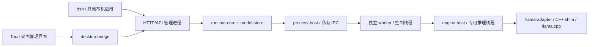

# Nexa Windows 总体方案与架构

日期：2026-10-03。当前范围见 [ADR0014](decisions/0014-windows-desktop-cpu-runtime.md)，具体协议见 [执行规格](../ai-runtime-v0.1-execution-spec.md)，完成事实见 [当前状态](../PROJECT_STATE.md)。旧跨端方案保留于 [历史索引](archive/windows-focus-2026-10-03/INDEX.md)。

## 1. 产品目标与边界

Nexa 是面向 Windows 桌面 CPU 的本地 LLM runtime。其他应用通过本机 API 调用；桌面 UI 管理模型与服务，聊天辅助验证。首要目标 Windows10 x64 / i5-8400，后续按实测覆盖更多 Intel/AMD 桌面 CPU 与 Windows11。

llama.cpp 是推理核心，Rust 负责稳定接入和资源/生命周期管理。封装不会凭空提升模型能力、减少模型权重或让未验证的模型成为支持项。当前单模型、单运行槽、有限队列，明确拒绝不支持能力。

API 兼容目标为官方 deepseek-ai/deepseek-harness（dsh）。优先通过其 `@deepseek-ai/dsh-llm-pi-ai` 自定义 `openai-completions` provider 对接；默认 `deepseek-official` Messages adapter 不在首期承诺中。实际协议与验收见 [harness契约](windows-harness-contract.md)。Telegram 等业务只作为可选调用方，不绑定发行。

## 2. Windows 执行链



API 进程是调度和模型注册状态的唯一所有者。worker 不创建第二个 Runtime；UI 与外部调用方共用同一服务，不各起一套模型。Windows 主线不再为移动宿主、其他引擎或跨端事件一致性新增架构约束。

## 3. 模块与职责

| 模块 | 实际职责 | 边界 |
| --- | --- | --- |
| runtime-types | 请求、事件、错误、模型/配置 DTO | 无原生指针、UI或HTTP类型 |
| runtime-core | 单actor、状态、有限队列、取消、deadline、空闲卸载 | 不重写推理算法，不直接操作原生模型 |
| model-store | managed导入与external只读目录、manifest/hash/准入 | 不下载模型市场、不存业务会话 |
| process-host / runtime-ipc | worker进程、Job回收、握手、私有NDJSON及有界信用 | 父端不链接llama，不能另造公共状态机 |
| runtime-worker | 控制读取、事件写入、原生执行组装 | 无公开监听端口，无第二调度器 |
| engine-host | 专用原生线程、执行器与取消句柄 | 只有独立取消标志可跨线程 |
| llama-adapter / C++ shim | 模板、tokenizer、采样、prefill/decode与资源 | 使用锁定llama.cpp，原生类型不向上泄漏 |
| runtime-api / runtime-cli | HTTP/SSE/鉴权/管理命令、发现/启动/关停 | 不在父进程加载原生库 |
| desktop-bridge / Tauri / React | 安全本机客户端、模型/服务管理与验证聊天 | token不交给前端脚本；桌面不复制推理队列 |
| dsh或其他调用应用 | 会话、工具执行、业务数据、重试策略 | 不从模型输出自动获得额外权限 |

Executor、ModelResolver、DTO/IPC边界已有Windows进程隔离、测试和解耦用途，保留这些合理角色；不为“桌面化”重写成上游server转发，不为可能的移动需求新建空trait/crate。依赖层级由实际功能决定。

## 4. 生命周期与资源归属

1. `ai-runtime serve` 持有数据目录锁、令牌、注册表和单一调度器；启动不加载模型
2. 首次有效load/请求按需启动唯一匹配worker。model冲突不自动挤出其他客户端正在使用的模型
3. worker经控制线程及时处理取消，在专用推理线程创建/释放engine/model/context/sampler
4. 正常退出或空闲卸载回收worker；worker崩溃时API保持可用，受影响运行/排队请求终结，显式load恢复
5. 不能确认OS回收时fail-closed，保留Faulted与清理错误，不能创建第二个worker或冒充已停止
6. 正常关闭UI默认只取消本窗口请求并保留runtime，显式同时退出影响全部客户端。托盘仅为计划中的管理入口，不改变安全关停所有权

```text
结构校验 → 有界排队 → 获得槽位 → 必要时加载
→ 模板/tokenizer与精确预算 → 请求级KV/sampler清理
→ prefill/decode → UTF-8/stop与唯一终态 → 清理
```

加载、排队和执行分别计时；输入预算包括模板及特殊token。输出有界、取消优先，不静默截断历史、换模型或自动重放已输出请求。当前256KiB在途文本、4KiB分片、信用与EventLease语义保持；详见 [ADR0004](decisions/0004-t03-process-isolation-and-credit-ledger.md)。该账本不是整个进程或模型内存上限。

## 5. API 与 harness 接入

现有接口：`/v1/models`、`/v1/chat/completions`文本子集与`/runtime/*`管理。SSE在Started后开始；Accepted/Queued/Loading不是现有HTTP完整任务流。当前status仅给聚合状态/活动ID。

dsh接入复用既有HTTP路径，先准确配置pi-ai provider，再增加真正需要的工具消息/工具输出流能力；不先增加另一套 `/v1/messages` 网关。协议兼容与模型具备可靠工具能力是两种验收，0.6B链路成功不能证明真实harness可用。

新增能力必须贯穿：HTTP DTO → core/IPC → shim模板/模型能力 → 输出事件 → HTTP/SSE → 实际客户端。tools JSON Schema不是已经实施strict约束解码的证明。工具执行仍由dsh负责，Nexa只生成可校验的请求，不在runtime执行shell或文件操作。

认证/Host/Origin、本机回环、实例发现与同TCP服务端proof保持既有边界。不能为通过harness接入而开放公网、任意CORS、泄露token或关闭错误校验。实际客户端的认证和出站字段通过契约测试与真实联调记录，见 [harness契约](windows-harness-contract.md)。

## 6. 模型与数据

| 数据 | 所有者 |
| --- | --- |
| GGUF、manifest、目录索引、运行配置、API凭据 | model-store/runtime，原始external文件只读 |
| tokenizer/context/KV/sampler | worker内原生推理线程 |
| 请求队列、取消、事件缓冲 | runtime-core，进程内有界 |
| 模型管理和显示偏好 | 桌面管理器，不假装当前服务已采用新配置 |
| 会话、harness工具状态、Telegram等业务数据 | 调用应用 |
| 性能/验证报告 | 验证体系，默认不记录私有正文、token或完整用户路径 |

external目录保持非递归只读、零复制登记、稳定ID和有效目录身份校验。登记元数据不是当前完整性证明；每次实际load先经受控准备复验文件/目录/精确准入。目录应用/重扫需先显式停止服务，不自动终止其他客户端。详见 [目录契约](t06-model-directory-contract.md)。

## 7. 桌面CPU与模型扩展

当前只有固定Qwen3-0.6B Q8_0/context2048获得精确准入。后续W02不仅调线程：按目标CPU可用内存和实际质量挑选桌面实用模型候选（如4B档），先审查锁定llama版本的架构、模板、量化支持，再锁资产并验收。

每个模型分别记录文本/工具/可选思考能力、上下文预算、内存和速度。不由GGUF扩展名或上游新版宣传授予本项目固定版本支持。新llama版本须单独升级决策与原有模型回归。

现有线程/context/batch/输出与空闲卸载设置继续复用；性能优化围绕正确参数、目标CPU实测、背压与UI刷新，禁止无基线重做调度。测量parent/worker/UI、冷加载、TTFT、prefill、decode、取消与空闲成本；配置值与未知实测值严格区分。

## 8. 交付与演进

保留runtime包、桌面包、独立验收器的分离与同source身份/PE依赖/许可/hash闭包。Windows10短验与Server2022 CI分别记录，Windows11和其他CPU不自动继承支持。

W00后，W01既有功能短验与W04最小harness文本互通并行；真实工具闭环依赖W02实用模型/工具能力准入。W04文本优先于非必要托盘美化，不被W03管理器阻塞；各阶段门槛通过后进入W05后期发行。无开发工具、离线和长期稳定性仍留后期；未验不等于通过。详见 [路线](roadmap.md)。Android历史不再是依赖，原研究源码/WIP不动。
