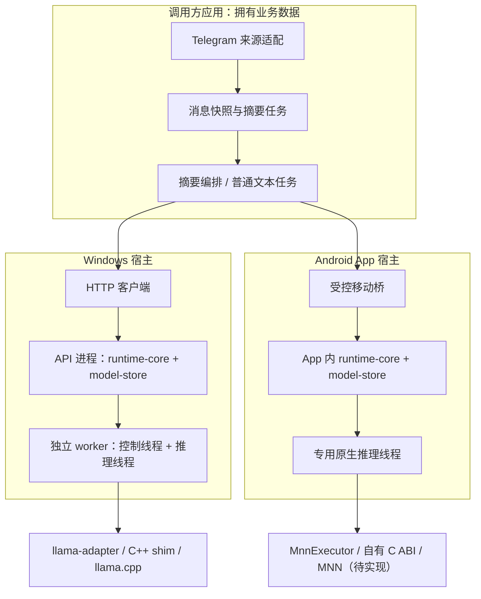

# Nexa 总体方案与架构

日期：2026-10-02。本文描述设计与模块边界；各项是否已经实现和验证见 [当前状态](../PROJECT_STATE.md)。runtime 的具体协议、默认值和验收以 [执行规格](../ai-runtime-v0.1-execution-spec.md) 为准；范围依据见 [ADR 0001](decisions/0001-nexa-scope-and-layers.md)，Android MNN 方向变更见 [ADR0008](decisions/0008-android-mnn-engine-and-package.md)。

## 1. 目标与设计取舍

Nexa 让用户自己的 PC / Android 应用复用一套本地推理能力。第一个业务验证是 Telegram 群消息摘要，后续应用可提交其他文本生成任务。

核心价值是稳定接入、资源受控和跨端一致语义。Windows 继续使用 llama.cpp，Android 主引擎采用 MNN；Nexa 不自行训练模型，也不承诺仅通过 Rust 封装提升模型能力或降低权重占用。

首版选择单模型、单运行槽、有限队列；明确不支持的能力返回错误。两端共享 Rust 类型、调度和事件语义，原生适配与模型资产格式分开，独立构建、独立运行、独立验收。Android 每个 App 有自己的实例和模型占用。

保留 Windows HTTP 服务和 Android 嵌入库两种宿主。桌面/移动 UI 是验证客户端，核心不依赖 UI；接入方不需要采用相同前端技术。

## 2. 总体分层



底部节点按平台分开，不能把既有 EngineHost 直接当作 MNN 执行器；两端不共享内存。摘要层经推理客户端接口调用不同宿主，runtime 不反向依赖摘要层。

## 3. 模块与依赖方向

| 模块 | 所有权与职责 | 边界 |
| --- | --- | --- |
| runtime-types | 请求、事件、错误、模型标识与配置 DTO | 无平台 UI、HTTP、原生指针 |
| runtime-core | 调度 actor、状态、队列、取消、超时和卸载策略 | 只依赖公共类型及存储/执行器抽象 |
| model-store | 管理目录、GGUF 导入；待增加 MNN 包 schema/引用闭包校验 | 不下载市场模型，不存聊天；旧 GGUF 行为保持 |
| engine-host | 已有 llama 原生专用线程执行器，供 Windows worker 使用 | 不创建第二调度器，不自动承担 MNN |
| MnnExecutor / mnn-adapter（待实现） | Android 专用原生线程、自有 C ABI 与 MNN 资源 | 实现既有 Executor 契约，不引入 llama/PC 宿主 |
| process-host | PC 父进程执行器与子进程回收 | 只依赖纯 Rust core/types/IPC，不链接 llama |
| runtime-ipc | 私有协议 DTO、严格有界 codec 与代际/信用校验 | 不含 native、HTTP 或第二套公共状态 |
| llama-adapter + shim | 模板、tokenizer、采样、prefill/decode、原生资源 | 只在推理线程使用模型/context |
| runtime-worker | IPC、独立控制路径、原生线程与错误隔离 | 无公开 HTTP 端口 |
| runtime-api / runtime-cli | HTTP/SSE、鉴权、错误映射与管理命令 | 不直接操作模型指针 |
| runtime-mobile | 初始化、生成、取消、状态及生命周期桥 | 不复制调度算法 |
| summary-types / summary-core | 来源快照、摘要任务、阶段结果和证据映射 | 独立调用层，不是 runtime 必需依赖 |
| 来源适配与宿主 UI | 获取消息、业务持久化、展示和用户操作 | 不拼接模型专用聊天模板 |

依赖组织规则：

1. `runtime-types` 位于底层；原生类型不进入公共 DTO。
2. core 所需 trait 由 core 的接口模块或公共抽象定义，engine-host/process-host/model-store 实现或被组装适配；避免 core 与 host 互相依赖。
3. API、worker、CLI、mobile 为组装入口。PC 父进程的最终依赖图不得引入原生推理库。
4. 摘要层只依赖自有类型和 `InferenceClient` 抽象；HTTP 与嵌入适配器在宿主侧组装。
5. 不为预测将来需要的每种后端预建空插件或大量空 crate；按纵向功能增加实际代码。

## 4. 推理执行与生命周期

### 4.1 Windows

管理进程持有数据目录实例锁、认证令牌、模型注册表和调度器。首次有效请求可选定模型并加载；请求不同模型时遵守原规格的 model_conflict，不自动挤掉当前模型。

worker 与父进程使用私有 stdin/stdout NDJSON。stdout 仅传协议，stderr 传日志；启动握手验证协议、shim 和 llama commit。控制读取与生成独立，取消不等待生成返回。事件写入有界且可取消。父端是唯一 Runtime；worker 通过 ExecutionEvents sink 直接使用 EngineHost。每次子进程启动使用新 session UUID，每次操作另有单调 operation_id，wire seq 与公共请求 seq 分开。

正常退出回收 worker；父进程异常退出由管道关闭和 Windows Job Object 等机制回收。worker 崩溃后当前及排队请求终结，进入 Faulted，显式 load 恢复。崩溃隔离不能替代 FFI 内存安全验证。

T05 将管理 CLI/API 与匹配 CPU worker 放在同一产品目录，worker 路径以已验证的产品可执行文件目录为准，不从调用方 CWD 或 PATH 猜测。原生静态库仍只进入 worker；微软动态 CRT 按实际 PE 闭包 app-local 提供。验收器另包、另有自身依赖，不参与产品发现、不为产品补DLL。构建身份、文件/许可/hash与目标机器验收边界见[ADR0006](decisions/0006-t05-windows-portable-package.md)。

### 4.2 Android

App 初始化一个 runtime 实例，经 MnnExecutor 使用 MNN。原生模型由专用线程独占，桥只传公共 DTO 和受控句柄；推理不阻塞 UI 线程。不先实现 Android llama.cpp；精确版本/CPU 原型、包与安全契约、APK、OpenCL、QNN、直接 Hexagon 依次推进，见[计划](t07-android-mnn-plan.md)。这些 Android 模块均未实现。

进入后台先停止接收本轮业务的新阶段，再取消当前推理，等待安全结束并卸载。原生调用尚未返回时继续显示正在停止，不释放使用中的资源。UI 重建不得继续使用已销毁句柄。

摘要调用层可以保存已完成阶段，用户重新发起继续时创建新的推理请求；runtime 不恢复旧请求。自动后台日报或常驻任务需要另行改变生命周期方案，目前没有这项能力。

### 4.3 单次请求

```text
结构校验 → 有界入队 → 获得槽位 → 必要时加载
→ 应用聊天模板与分词 → 精确预算校验
→ 清理请求间 KV / 初始化 sampler → prefill → decode
→ UTF-8 与 stop 处理 → 唯一终态 / usage → 清理本次资源
```

queue、load、execution 分别计时。模板 token 计入输入；不得静默截断、跨请求复用 KV 或在输出后自动重放。

每请求最多 256 KiB 待发送文本、delta 最多 4 KiB 等具体限制沿用执行规格。预算与慢消费者处理在原生回调、IPC、HTTP/桥接各层共同落实，不能只限制最后一层。PC 父端保守预留16 KiB暂存和两个120 KiB信用；每个信用只准一条≤4 KiB文本，实际消费或丢弃 EventLease 后才退账。详见 [T03决策](decisions/0004-t03-process-isolation-and-credit-ledger.md)。这个输出账本不等于模型、原生tokenizer、输入帧、分配器或整个进程内存上限。

### 4.4 业务任务与推理请求

`summary_job_id` 标识整份摘要；每个阶段有自己的 stage_id，每次实际推理有独立 UUID request_id。一次摘要可能产生多个请求，任务进度由调用层统计。

默认按需要逐次提交，避免预先填满 runtime FIFO。整体取消先禁止提交后续阶段，再取消已提交请求并等待实际终态。取消接口返回 202 只代表接受取消意图。

任务总截止时间和总生成预算由摘要层维护；runtime 的单次 execution_timeout 不能替代整份摘要限制。某一阶段失败不能令调用层无限重试或静默报告完整成功。

## 5. SDK 与接口边界

### 5.1 已有设计契约

“已有”指执行规格已定义，不表示代码已实现：

- Windows：本机 `/v1/models`、`/v1/chat/completions` 文本子集及 `/runtime/*` 管理接口。
- 移动：受控初始化、导入、加载、生成、取消、状态和生命周期入口；独立 request_id。
- 两端：错误码、usage、请求终态和模型状态语义一致；HTTP 使用其兼容映射，原生桥可订阅公共事件。
- 接入产物：Windows runtime 包与最小 HTTP 示例；Android 原生库、Flutter 桥及独立接入示例。Rust crate 的版本与分发方式在工程阶段确定。

T04 本机鉴权、原子注册预约、同连接服务端proof和96KiB非流式上限见[ADR0005](decisions/0005-t04-loopback-http-and-management.md)。HTTP/CLI管理进程仅依赖Store/core/ProcessHost，不链接native。

HTTP 正常 SSE 在 Started 后才开始；Accepted/Queued/Loading 是内部/原生事件，不意味着当前 HTTP 已提供全量任务事件流。调用方先生成 request_id，以便响应头返回前取消；当前 runtime/status 仅提供聚合状态与活动 ID。

### 5.2 摘要需要的契约扩展

以下为 S01 的设计输入，不能作为已经发布的接口调用；实现前记录独立 ADR 并同步执行规格、types、HTTP、IPC 与移动桥：

| 能力 | 必须明确的语义 |
| --- | --- |
| 模型能力查询 | 有效 context_size、默认/最大输出预算、模型 hash、模板与思考模式标识、配置代际 |
| 精确 prompt 预算检查 | 使用与生成相同的模板/tokenizer，包含特殊 token；不执行 prefill/decode，不返回原生句柄 |
| 计数期间的调度 | 在资源所有线程执行；明确 Ready/Busy/Unloaded 行为、超时与取消，不从另一个线程并发访问 tokenizer/model |
| 代际一致性 | 预算结果绑定模型/模板/加载配置；实际生成再次校验，旧结果不构成预留或成功保证 |
| 请求状态观察 | 明确 HTTP 等待期间可查询范围、终态保留时间、重启后失效及断连处理；不提前承诺可恢复 SSE |
| 应用格式校验 | response_format 仍不受支持；固定文本/JSON 提示没有结构保证，解析和有限重试由应用处理 |

在这些接口完成前，可以用最小原生测试入口验证分词和摘要可行性，但不能为此让 HTTP 父进程链接 llama 或复制一套不一致的模板逻辑。

## 6. 数据与持久化归属

| 数据 | 所有者 | 原则 |
| --- | --- | --- |
| 模型文件、manifest、配置、API 令牌 | runtime/model-store | 目录锁、校验、临时复制及原子提交 |
| tokenizer/context/KV/sampler | 原生执行器 | 单线程生命周期，不交给 UI |
| request 状态、队列、事件缓冲 | runtime-core | 进程内有界；不在重启后恢复生成 |
| Telegram 原消息、来源账号与获取权限 | 调用应用 | 不进入 runtime 持久化 |
| 快照、分块、阶段结果、摘要产物 | 摘要调用层 | 版本化、记录覆盖；格式与保留策略在 S00/S03 冻结 |
| 性能与验证报告 | 开发验证体系 | 保存参数与统计，避免提交私有正文和真实凭据 |

导入后的 manifest/index 必须能处理复制或提交中断。模型元信息解析不能破坏 PC 父进程不链接原生推理库的边界；需要原生验证时经隔离执行器完成。Android 文件选择 URI 将 MNN 包导入 App 私有持久目录，校验 graph/weights/tokenizer/config/template 与后端变体的完整引用闭包、路径、逐文件及整体 hash，原子发布；运行配置和后端缓存与不可变包隔离。现有单文件 ResolvedModel/manifest 需在 T07-B 迁移，具体协议尚未冻结。

原文保存和摘要缓存不是跨请求 KV 缓存，生命周期分别管理。不因摘要功能给 runtime 加入消息数据库、Telegram 客户端或账号系统。

## 7. 资源与安全边界

Windows API 仅监听回环地址，管理和生成接口使用本地令牌；默认不开放任意 CORS。Tauri 通过 Rust 代理调用，令牌不进入前端脚本。现有令牌代表可信本机客户端，不宣称具备多租户隔离。

群消息、模型输出和文件内容均为数据，不能改变系统权限或驱动外部操作。摘要层不执行消息里的命令，不自动发送群消息。来源引用由应用根据已知映射生成，不信任模型编造 URL。

日志只记录 ID、状态、用时、token 数、后端及错误码。临时文件和业务缓存按归属处理；诊断正文须由用户主动开启。

总内存评估包含模型、KV、计算缓冲、runtime、UI 和摘要业务数据。消息输入和中间结果必须有界；按页读取/分块处理，避免同时持有整群的重复大字符串。

## 8. 性能与质量验证

Windows 10 CPU 为首要交付范围，Windows 11后续。Android 面向 Snapdragon 8 Elite 及后续代际，公开首测参考 OnePlus 15 / SM8850 / v81，SM8750 / v79 为兼容档；公开来源见[计划](t07-android-mnn-plan.md)。实际 Android 版本、ABI/页大小、内存、驱动和持续性能待诊断，不由型号推定支持。

- 先以小模型验证模板、中文流式、取消和重复释放，再比较 1.7B/4B 等业务候选。
- 上游与封装使用相同模型、模板、采样、线程、上下文和设备条件；区分 prefill、decode 与端到端耗时。
- 同时记录短输入、长输入和完整摘要任务；一份摘要的累计耗时可能包含多次推理。
- Android 记录持续 15 分钟表现与后台取消；CPU 基线稳定后依次验证 OpenCL、QNN v79/v81 和直接 Hexagon，分别证明实际执行与 fallback。
- 摘要单独验收覆盖、事实支持、发言归因和引用；runtime 通过 A01 不代表摘要业务达标。

性能门槛和业务默认模型由 S00 样本与实测确定。Android GPU/NPU 已纳入分阶段计划，QNN 与直接 Hexagon 的量化/产物/依赖分别管理；失败可按已验证 profile 在生成前明确兜底 CPU，输出后不重放。扩大上下文、前缀缓存和结构化约束输出仍是独立研究，不预先承诺收益。

## 9. 演进方式

原生链路 → 调度 → Windows 与 Android 宿主 → 独立应用接入 → 发行验收，详见 [路线](roadmap.md)。摘要路线以可替换的推理客户端和来源适配器独立推进。

公共接口、状态机、数据目录、持久化版本或平台范围改变时，先记录决策并同步对应规范及验收。内部可逆实现细节由当前任务自行解决，不反复要求用户批准普通工程选择。
