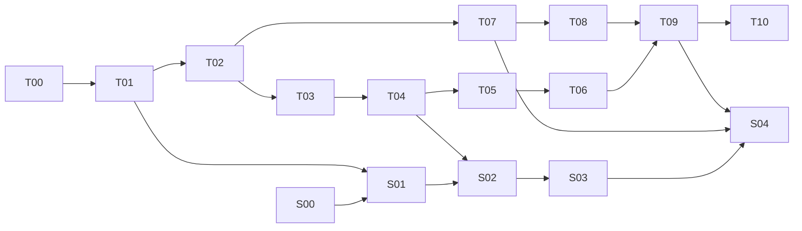

> 历史快照：2026-10-03 Windows 范围收敛前的文档，仅供追溯，不是当前要求或待执行任务。原文事实未重新验收；只增加本说明并修正相对链接。当前入口见 [PROJECT_STATE.md](../../../../PROJECT_STATE.md)。

# Nexa 持续开发路线

日期：2026-10-02。路线描述目标和依赖，不代表已经实现或获得所有分支的执行授权。唯一动态进度入口是 [PROJECT_STATE.md](../PROJECT_STATE.md)。Android MNN 方向以 [ADR0008](../../../decisions/0008-android-mnn-engine-and-package.md) 为准。

当前排期以[ADR0013](../../../decisions/0013-windows-focus-and-android-mnn-chat.md)为准：回到Windows，Nexa独立Android App自研暂停；用户计划安卓修改MNN Chat。下列Android任务保留为历史计划，不要求当前继续或先完成Android才能推进Windows。

## 1. 两条路线与完成边界

- runtime 路线沿用执行规格 T00–T10，完成安全的真实推理、两种宿主与发行验收。
- 摘要路线使用 S00–S04，验证业务输入、分块证据链、质量和独立应用接入。
- D00 为本轮文档基线，不计为 T00，也不计为任何源码、模型或真机验收。
- runtime v0.1 完成条件仍由执行规格第 14 节定义；Telegram 摘要可用还须完成摘要路线的业务验收。两者分别报告。

## 2. 推荐依赖顺序

这是首轮以 Windows HTTP 验证摘要的推荐排期；切换首测宿主时记录影响。S00 可在 runtime 开发期间独立开展。S01 只冻结公共契约，不代表各宿主已经实现。

若 S01 冻结时 T04/T07 尚未完成，可在对应宿主任务纳入扩展；若基础宿主已经完成，Windows 扩展由 S02 的首个切片落实，Android 扩展由 S04 的首个切片落实，均同步 types/core/adapter/IPC 等受影响层并补充契约复验。各自通过后才进入摘要管线或移动接入；不能将旧 T04/T07 的验收追溯记为新接口通过。基础 runtime 不因此被未决的 S00 阻塞。

T07 在 T02 后独立推进 MNN，不等待 T06 完整收口，也不先实现 Android llama。完整 T07/T08 仍须真机证据，构建/小模型探针不能替代移动端验收。

## 3. runtime 任务

详细内容和 A01–A26 判据在 [执行规格](../ai-runtime-v0.1-execution-spec.md) 第 10–14 节，不在这里复制全部协议。

| ID | 前置 | 最小交付与阶段门槛 |
| --- | --- | --- |
| T00 | 工程开发授权 | Git/忽略规则、最小 workspace、工具链与 llama commit、模型来源/hash、上游 Windows CPU 真实基线 |
| T01 | T00 | C ABI、安全封装、模板/分词/采样、真实中英文流式与取消、重复加载释放 |
| T02 | T01 | model-store、单一调度 actor、有限队列、状态机、deadline、资源回收；相关 A05–A12 |
| T03 | T02 | 独立 worker、握手、NDJSON、取消控制路径、崩溃隔离和父子进程退出 |
| T04 | T03 | HTTP/SSE、令牌、CLI、错误与兼容子集、实际 api-smoke；届时已冻结的摘要公共契约可同步实现 |
| T05 | T04 | Windows CPU包、依赖清单、Release包完整性/真实CI及独立Windows 10短验；A20无开发工具/离线后期验证 |
| T06 | T05 | 最小桌面模型管理/聊天验证 UI、发现与启动/退出；不以截图替代推理 |
| T07 | T02 | MNN CPU 原型、独立 Executor/C ABI、多文件模型包；共享 core，真实模型预算/采样/取消通过 |
| T08 | T07-B/C | MNN Chat对标首个可用文本APK：目录/单源下载续传/导入/存储、多会话、设置和诊断，见[产品计划](../../../android-app-parity.md) |
| T09 | T06、T08 | 契约与真实 smoke、性能/内存/包体/取消记录、完整支持矩阵 |
| T10 | T09 | 其余后端或平台独立扩展；Android 已列入下述 T07-D～F，不须为研究等待 T09 |

T00 的锁文件和支持矩阵必须来自实际可构建组合，不先编造版本号或性能数值。模型/设备不可用时完成独立工程部分并列出未验项，不越过阶段验收门槛。

### 2026-10-01 当前开发门槛调整

T05固定Release CI与独立Windows 10手工短验已通过，见[T05记录](../../../verification/2026-10-01-t05-windows-package.md)。无开发工具、实际离线和长期稳定性列为后期验证；T05据当前阶段范围收口，T06继续，不把尚缺设备条件写成通过。

A20与长期稳定性证据仍未验证；其后期验收要求、原始报告skipped/unverified和完整v0.1发布门槛保留。

### Android MNN 切片顺序

[执行计划](../../../t07-android-mnn-plan.md)给出逐项验收和源码入口，T07-A已有独立探针/Linux真实模型/Android原生构建，尚缺真机；预转换资产的导出来源未知按[ADR0010](../../../decisions/0010-model-artifact-and-conversion-provenance.md)单列，非独立阻塞；其余切片仍待实施：

| 切片 | 依赖与交付 |
| --- | --- |
| T07-A | 精确 MNN commit/工具链/模型来源锁定，真实 Android arm64 CPU 原型 |
| T07-B | A 后完成 MnnExecutor、自有 C ABI、多文件包/引用校验、模板/每请求采样/预算/取消；共用类型变更复验 Windows |
| T07-C / T08 | B后完成安全移动宿主并交付首个可用文本APK；目录/下载/导入/历史属App，后台取消/安全卸载、UI重建、飞行模式与持续运行逐项验收 |
| T07-D | CPU APK稳定后验证 OpenCL、真实算子执行/回退、缓存及生命周期 |
| T07-E | CPU/GPU对照后验证 QNN v79/v81 独立产物、SDK依赖与设备profile；CPU兜底须明确报告 |
| T07-F | 直接 Hexagon 独立实验，不能复用 QNN 支持结论；不阻塞已经通过的 CPU 基础版 |

目标为 Snapdragon 8 Elite 及后续，公开参考 OnePlus 15 / SM8850 / v81，SM8750 / v79 为兼容档。版本、设备和新许可条件按计划核验，不下载 SDK 或接受协议来假定补齐依赖。GPU/NPU 单独准入，全部纳入计划不等于同时通过发布验收。

## 4. 摘要任务

| ID | 前置 | 交付 | 完成判据 |
| --- | --- | --- | --- |
| S00 输入与评估基线 | 可独立研究 | 来源/触发决策、SourceSnapshot 契约、固定样本、人工标注及质量/耗时目标 | 接入范围明确；样本可定位；质量门槛可执行；私有原文不进仓库 |
| S01 摘要所需公共契约 | S00、T01 | 模型能力、模板后 token 计数、配置代际、调度/取消、状态观察 ADR；同步 API/IPC/桥协议和用例 | 不依赖未定义接口；不引入父进程原生库或多线程模型访问；各宿主实现任务明确 |
| S02 分块与证据管线 | S01、T04 | 先补齐 Windows 公共契约及复验，再实现标准化、token 分块、带证据提取、多层合并、解析和有界修复 | 扩展契约通过；S-A01–S-A06；真实 GGUF 完成固定样本，报告业务质量和整体耗时 |
| S03 任务生命周期 | S02 | 总预算、进度/取消、检查点与缓存失效、存储决策 | S-A07–S-A08；失败/中断不伪造完成，显式继续不重放旧 runtime 请求 |
| S04 两端实际接入 | S03、T07、T09 | 先补齐 Android 公共契约及跨端复验，再交付独立调用方示例和两端质量/性能报告 | 扩展契约通过；S-A09–S-A10；实际应用能接入；核心验收与摘要质量分别达标 |

导出文件是可选验证来源，不因写在方案里就自动成为用户选择。没有来源选择时可用合成记录研究通用接口，但 S00 真实接入基线保持未完成。

账号/机器人接入、定时调度和持续多群摘要在来源及触发决策确定后分拆任务；不默认引入 Telegram 原生依赖、消息数据库或后台服务。

## 5. 研究实验与决策

| 实验 | 控制变量与记录 | 决策用途 |
| --- | --- | --- |
| 候选模型质量 | 固定样本、模板、非思考模式、量化和提示；比较 0.6B/1.7B/4B 候选 | 选择默认模型，区分链路验证和业务可用 |
| 分块策略 | 按 token 的顺序分块、有限回复上下文、按话题组织；同样本同模型 | 衡量遗漏、重复、归因与成本 |
| 两端性能 | 相同模型/参数下记录加载、输入处理、生成、整任务耗时和峰值内存 | 调整上下文、线程和输出预算 |
| 持续性能 | Android 前 1 分钟和第 15 分钟、取消及后台切换 | 选择可用负载和生命周期参数 |
| 格式与证据 | 格式错误、未知引用、原文不支持、length 截断 | 决定是否值得增加结构化约束输出 |
| 增量复用 | 相同、追加、编辑/删除及策略变更的快照 | 确定缓存规则及失效成本 |

若小模型质量不足，先调整模型/任务范围并重新评估；若主要耗时在输入处理，研究分块、已完成结果复用或上下文策略；若持续性能不足，再选择 CPU 优化或 GPU 实验。记录实验结论，避免无基线地同时改变多个因素。

## 6. 状态、验收与交接

任务状态：

- 未开始：没有实施；依赖尚缺也使用此状态。
- 进行中：已在授权范围内实施，尚未满足完成判据。
- 待验证：实现或文档产物已就绪，但必需检查、模型或设备证据不足。
- 已完成：交付与对应验收都有证据，状态/规范同步。
- 受阻：当前任务遇到具体不可推进的外部条件，记录原因、已尝试事项和解除条件；继续可独立完成的工作。

每次交接最少保留：当前任务 ID、已完成步骤、证据路径、尚缺验证、下一条可执行动作、待决事项。持续开发的范围一经用户授权，可按依赖推进，不为正常实现步骤反复索要确认；改变产品范围、权限或外部副作用时按会话授权处理。

## 7. 证据与产物约定

- 可审查验证摘要放 `docs/verification/`，详细本机日志放 `artifacts/verification/`。
- 报告包含项目/对应引擎commit、资产来源路径与转换来源（预转换可显式unknown，自导出须精确commit）、工具链、模型文件/包与模板 hash、设备、参数、实际后端/回退、命令及退出码、pass/fail/skipped/unavailable。
- 当前无 Git 时 commit 写 unavailable；没有模型或设备实测时不写通过。
- 真实模型自动 smoke 验证非空文本、预算、终态和资源；跨设备不要求逐字一致。
- 纯文档只检查内容、链接和变更，不运行尚未实现的工程命令或编造性能测试。
